# AgenticWorkflow: Architecture and Philosophy

This document articulates the **design philosophy** and **architectural blueprint** of the AgenticWorkflow project.
Going beyond "what exists" (`CLAUDE.md`, `AGENTS.md`) and "how to use it" (`USER-MANUAL`), it systematically explains **"why it was designed this way."**

---

## 1. Design Philosophy

### 1.1 Core Conviction: Workflow Design Is an Intermediate Artifact

The fundamental conviction of this project is summarized in one sentence:

> **The workflow document (`workflow.md`) is a blueprint; the final deliverable is an actual system operating according to that blueprint.**

```
                  ┌─────────────────────────┐
                  │     Phase 1: Design     │
                  │ "workflow.md Generation"│
                  │ ── Intermediate Output ──│
                  └────────────┬────────────┘
                               │
                               ▼
                  ┌─────────────────────────┐
                  │ Phase 2: Implementation │
                  │  "Actual Running System"│
                  │   ── Final Deliverable ── │
                  └─────────────────────────┘
```

Many automation projects halt at "making plans." AgenticWorkflow explicitly guards against this trap. While Phase 1's `workflow.md` is a valuable design document in itself, **it remains incomplete unless agents, scripts, and automations actually run in Phase 2.**

This conviction permeates every design decision across the project:
- Why Skills include **executable implementation patterns**, not just prompt collections.
- Why the Workflow template mandatorily includes a Claude Code Configuration section.
- Why concrete configuration examples for implementation elements (Sub-agents, Hooks, MCP) are provided in reference documents.

### 1.2 Quality Absolutism

All decision-making in AgenticWorkflow converges on **a single criterion**:

> Speed, token cost, workload, and length limits are completely ignored.
> The sole criterion for every decision is the **quality of the final deliverable**.

This is not a slogan. It is a concrete behavioral rule for design:

| Situation | Conventional Choice | AgenticWorkflow Choice | Rationale |
|-----------|---------------------|------------------------|-----------|
| Number of workflow stages | Reduce for efficiency | Increase stages if it elevates quality | Absolute Criterion 1 |
| Number of agents | Minimize to cut costs | Add agents if quality improves | Absolute Criterion 1 |
| Verification iterations | Settle with a single pass | Allow repetition if deliverables improve | Absolute Criterion 1 |
| Sub-agent vs. Agent Team | Whichever is faster | Whichever yields higher final quality | Sole agent selection criterion |

This principle is reiterated in both skills, contextualized to their respective domains:
- **workflow-generator**: "Accurate workflows over fast workflows"
- **doctoral-writing**: "Academic rigor over revision count"

### 1.3 Theoretical Foundation: Connection to Recursive Language Models

`coding-resource/recursive language models.pdf` is a 2025 study from MIT CSAIL providing the **architectural background for agent design** in this project.

**RLM Core Paradigm:**

```
Traditional LLM:  Input → [Neural Network Processing] → Output
                          (Context Window Limitation)

RLM:              Input → [Python REPL Environment] → LLM writes code to explore input
                          (Unlimited Context, Recursive Decomposition)
```

**Structural Mapping to AgenticWorkflow:**

| RLM Concept | AgenticWorkflow Counterpart | Design Rationale |
|-------------|----------------------------|------------------|
| Python REPL Environment | SOT File (`state.yaml`) | Programmatically manage external state |
| Recursive Sub-call | Sub-agent Delegation | Decompose complex tasks and delegate to specialists |
| Code-based Filtering | Pre/Post-processing Scripts | Deterministic data refinement prior to neural network input |
| Variable Persistence | Deliverable Files (`output-*.md`) | Persist intermediate results in external environment |
| Answer Verification | Hook-based Quality Gate | Automated verification stages |
| Structured Metadata | Knowledge Archive Metadata (`phase`, `phase_flow`, `primary_language`) | Structured cross-session indexing |

The core discovery of the RLM paper — **"Do not feed prompts directly into the neural network; treat them as objects in an external environment"** — is the theoretical root of AgenticWorkflow's Design Principle P1 (Data Refinement) and Absolute Criterion 2 (SOT).

In particular, RLM's **P8 correspondence** is noteworthy: RLM uses Python code (deterministic) as the backbone of measurement and LLMs (probabilistic) as reasoning assistants. This perfectly matches AgenticWorkflow's structure, where Python scripts handle pre-/post-processing while AI agents focus solely on judgment, analysis, and creative generation.

### 1.4 Heredity Design Philosophy (DNA Inheritance)

AgenticWorkflow's raison d'être extends the conviction of §1.1: this codebase is not merely a closed, self-contained system, but a **parent organism that gives birth to child agentic workflow automation systems**.

> The most critical insight in stem cell differentiation — **every differentiated cell retains the full genome of the parent.**
> Muscle cells and nerve cells perform entirely different functions, yet both share the exact same DNA.
> Only the expressed genes differ; the genome itself is identical.

**Genome Components → Form Embedded in Child Workflows:**

| Parent Genome (DNA) | Form Embedded in Child Workflow | Expression Variation Example |
|---------------------|--------------------------------|------------------------------|
| 3 Absolute Criteria | `Inherited DNA` section — contextualized per domain | SW Dev: strong CCP expression / Content: strong Quality Absolutism expression |
| SOT Pattern | `state.yaml` + single write point | Identical expression across all domains |
| 3-Stage Structure | Research → Planning → Implementation | Research Automation: strong Research expression |
| 4-Layer Verification | L0 → L1 → L1.5 → L2 | High-risk domains: strong L2 expression |
| P1 Containment | Python deterministic validation | Data pipelines: strong P1 expression |
| Safety Hook | Dangerous command blocking | Infrastructure automation: strong Safety expression |
| Adversarial Review | Generator-Critic pattern | Research/publishing: strong Review expression |
| Decision Log | Auto-approval decision recording | Identical expression across all domains |
| Context Preservation | Cross-session memory preservation | Long-term projects: strong expression |

**Structural Inheritance vs. Simple Reference:**

Inheritance is fundamentally distinct from "referencing." A reference allows choosing "whether or not to apply this principle," whereas inheritance means being **constituted of** these principles from birth. The structural inclusion of the `Inherited DNA` section in `workflow.md` by `workflow-generator` when spawning a child represents the concrete implementation of this distinction.

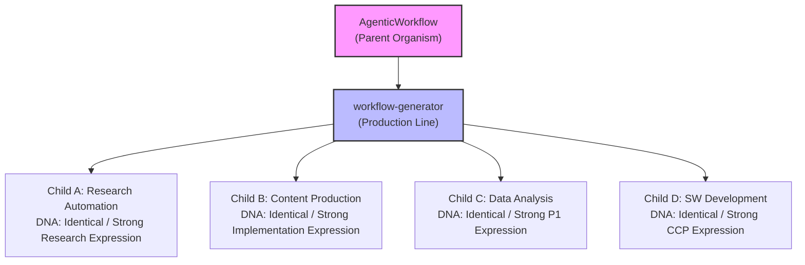

**Connection to RLM:** RLM's **Variable Persistence** — the pattern of persistently storing intermediate results in an external environment — serves as the theoretical foundation for inheritance. The parent's genome is persistently stored as external objects in `soul.md`, `AGENTS.md`, and `workflow-template.md`, and `workflow-generator` reads these objects to inject them into the child's architecture. Because genetic information resides in files (external environment) rather than inside prompts (neural network internals), the genome remains preserved across session transitions.

Details: `soul.md §0`.

---

## 2. Absolute Criteria System

The Absolute Criteria constitute the **constitution** of this project. They supersede all design principles, guidelines, and conventions; if any principle conflicts with an Absolute Criterion, the Absolute Criterion wins.

### 2.1 Absolute Criterion 1: Quality of the Final Deliverable

- Speed, token cost, workload, and length limits are **completely ignored**.
- The sole criterion for every decision is the **quality of the final deliverable**.
- Rather than making things faster by reducing steps, choose the direction that raises quality even if it requires adding steps.

### 2.2 Absolute Criterion 2: Single-File SOT + Hierarchical Memory Structure

- Concentrate all shared state into a **single file** (no distributed state).
- **Write Permission**: Held exclusively by the Orchestrator or Team Lead.
- **Other Agents**: Read-only + deliverable file generation.
- **Conflict Prevention**: Prohibit designing structures where multiple agents modify the same file concurrently.

### 2.3 Absolute Criterion 3: Code Change Protocol (CCP)

- Before writing, modifying, adding, or deleting code, **must internally execute the 3 steps**.
- **Step 1 — Understand Intent**: Define change purpose and constraints in 1-2 sentences.
- **Step 2 — Ripple Effect Analysis**: Investigate direct dependencies, call relationships, structural relationships, data models, tests, configuration, and documentation at an expert level. Prior notice is mandatory if tight coupling or shotgun surgery risks are detected.
- **Step 3 — Change Plan**: Propose a step-by-step change sequence (file/function → dependency propagation → test/doc alignment). Propose decoupling opportunities alongside.

**Proportionality Rule:**

| Change Scope | Applied Depth |
|--------------|---------------|
| Minor (typos, comments) | Step 1 only |
| Standard (function/logic changes) | Full 3 steps |
| Large-scale (architecture, API) | Full 3 steps + mandatory prior user approval |

While Absolute Criterion 1 (Quality) defines "what we optimize for" and Absolute Criterion 2 (SOT) defines "how we structure data," Absolute Criterion 3 defines **"how we behave when changing code."** High-quality code stems from a rigorous process that analyzes dependencies, coupling, and ripple effects before implementation.

> **Detailed Protocol** (full analysis checklist, applied examples, communication rules) is defined in **AGENTS.md §2 Absolute Criterion 3**.
> All steps of CCP are executed while internalizing the **Coding Anchor Points (CAP-1~4)**: Think Before Coding, Simplicity First, Goal-Based Execution, and Surgical Changes.

### 2.4 Priority Resolution: Quality > SOT, CCP

Absolute Criterion 1 (Quality) sits at the very top. Absolute Criterion 2 (SOT) and Absolute Criterion 3 (CCP) are **co-equal means** to guarantee quality. Whichever criterion it is, when it conflicts with Absolute Criterion 1, quality wins.

```
Absolute Criterion 1 (Quality) — Highest. The reason every criterion exists.
  ├── Absolute Criterion 2 (SOT) — Means of guaranteeing data integrity
  └── Absolute Criterion 3 (CCP) — Means of guaranteeing code-change quality
```

Because Absolute Criteria 2 and 3 operate on different dimensions, direct conflict between them is unlikely:
- **Absolute Criterion 2**: Data architecture during workflow execution (who writes where).
- **Absolute Criterion 3**: Change process during code development (how to analyze and modify).

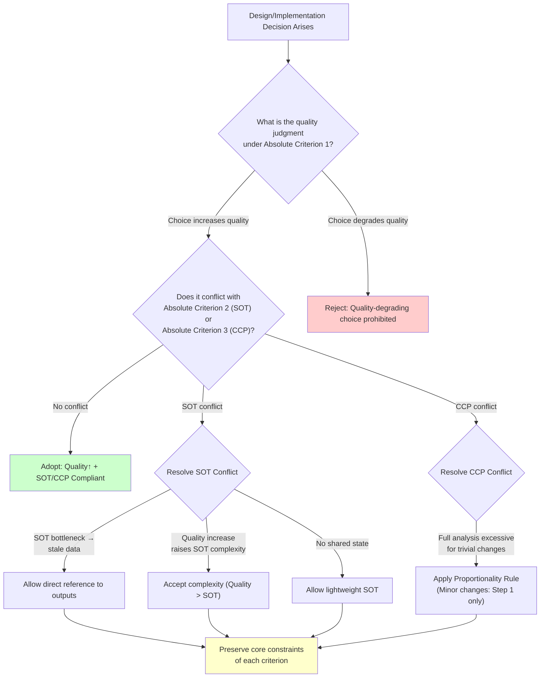

**Concrete Conflict Scenarios:**

| Scenario | Conflicting Criteria | Resolution Method | Preserved Invariant |
|----------|----------------------|-------------------|---------------------|
| Team Lead is sole SOT write point, so teammates work with stale data | 1 vs 2 | Allow teammates to directly reference each other's output files | Single write point of the SOT file itself |
| Adding stages for quality improvement increases SOT state complexity | 1 vs 2 | Accept increased complexity | Absolute Criterion 1 priority principle |
| SOT unnecessary in fully independent parallel tasks | 1 vs 2 | Allow lightweight SOT | Document rationale explicitly in workflow |
| Full CCP analysis introduces excessive overhead for minor changes | 1 vs 3 | Apply Proportionality Rule (Step 1 only) | The protocol itself is never skipped |

### 2.5 Contextualization of Absolute Criteria by Skill

The Absolute Criteria are abstract on their own. To exert practical power, they must be **contextualized to each skill's domain**:

| Absolute Criterion | workflow-generator | doctoral-writing |
|--------------------|--------------------|------------------|
| **1. Quality** | Accurate workflows over fast workflows. Add stages if quality increases | Ignore revision count/workload. Academic rigor, clarity, and logical depth are the sole criteria |
| **2. SOT** | `workflow.md` is the single definition point for design and state management | Maintain consistency in terminology, arguments, citations, and style across manuscript (Terminology SOT, Citation SOT) |
| **3. CCP** | Dependency and ripple effect analysis required when implementing workflow code. Manage coupling across components (Agents, Hooks, SOT) | N/A — Text editing domain, not code changes. However, applies when modifying this skill's own code |
| **Priority Conflict** | If SOT structure causes a quality bottleneck, adjust it. If CCP analysis is excessive, apply Proportionality Rule | If consistency harms accuracy, accuracy comes first → retroactive consistency update |

This contextualization is the reason why the first rule of skill development ("Must include all Absolute Criteria — contextualized to the domain") exists. In skills belonging to non-coding domains, contextualizing Absolute Criterion 3 (CCP) may be N/A.

---

## 3. Architecture Overview

### 3.1 Overall System Architecture

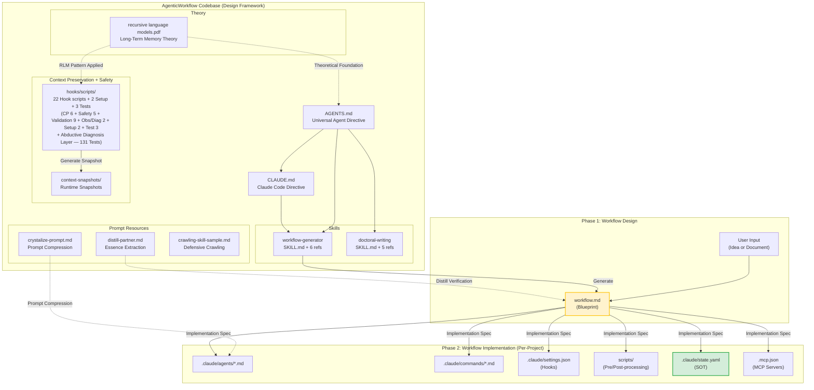

### 3.2 Input-Output Flow of the Two-Stage Process

| Stage | Input | Tool | Deliverable | Nature |
|-------|-------|------|-------------|--------|
| **Phase 1** | User idea or descriptive document | workflow-generator skill | `workflow.md` | Intermediate artifact (Blueprint) |
| **(Distill Verification)** | Generated `workflow.md` | distill-partner.md interview | Verified `workflow.md` | Optional quality enhancement |
| **Phase 2** | Verified `workflow.md` | Claude Code implementation | Running agent, script, and automation system | **Final deliverable** |

### 3.3 Three-Stage Workflow Structure

Every workflow follows the identical 3 stages. This is not a convention, but a **structural constraint**:

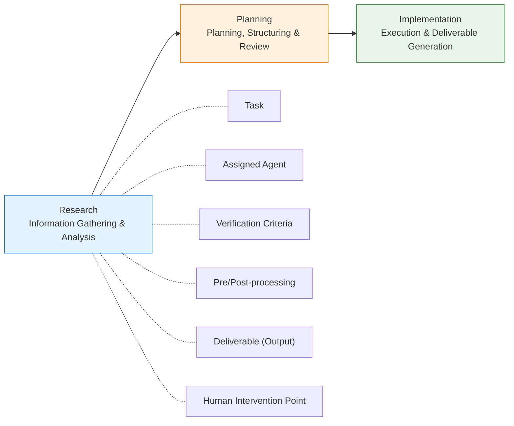

**Why the 3 stages are a structural constraint:**
- **Skipping Research**: Agents operate on insufficient information → quality drops (violates Absolute Criterion 1).
- **Skipping Planning**: Implementation proceeds without human review → compounding directional errors.
- **Omitting Implementation**: Incomplete system existing only as blueprints (violates core conviction).

---

## 4. Component Architecture

### 4.1 Overall Component Relationships

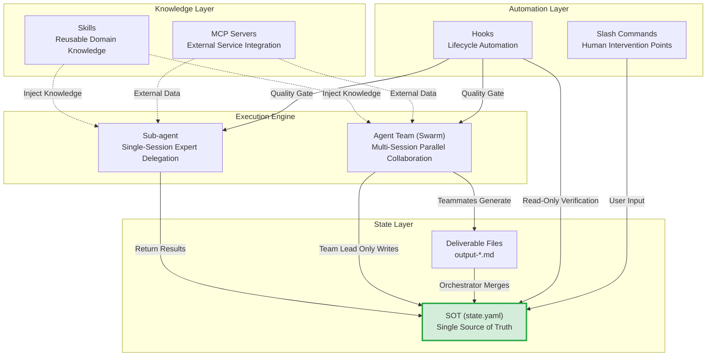

### 4.2 Sub-agent — Single-Session Expert Delegation

**Design Philosophy:** Employed for tasks where a single specialist maintaining deep context and consistent execution is necessary to achieve high quality.

```
Orchestrator ──── Delegate ────→ @researcher (Single Session)
                                   │
                                   ├── Independent context
                                   ├── Specialized tools only
                                   ├── Returns result only
                                   └── Orchestrator updates SOT
```

**Definition Location:** `.claude/agents/*.md`

**Core Design Principles:**
- **Single Responsibility**: Exactly one role per agent.
- **Tool Minimization**: Allocate only necessary tools (security and focus).
- **Appropriate Model Sizing**: Select model based on task complexity.

**Model Selection Criteria (Quality-Centric):**

| Model | Suitable Tasks | Selection Rationale |
|-------|----------------|---------------------|
| `opus` | Complex analysis, research, writing | Core tasks requiring maximum quality |
| `sonnet` | Collection, scanning, structuring | Stable quality for recurring tasks |
| `haiku` | Status checks, simple evaluations | Low-complexity auxiliary tasks |

> **Note:** Model selection is strictly governed by quality criteria. The determining question is not "is Haiku cheap?", but "is Haiku's quality sufficient for this task?"

**Frontmatter Design:**

```yaml
name: researcher           # Unique identifier
description: "..."         # Trigger description for auto-delegation
model: sonnet              # opus / sonnet / haiku
tools: Read, Glob, Grep    # Allowed tools (principle of least privilege)
disallowedTools: Write     # Blocked tools (optional)
permissionMode: default    # default / plan / dontAsk
maxTurns: 30               # Maximum turns
memory: project            # user / project / local
skills: [writing-style]    # Injected skills
mcpServers: [slack]        # Available MCP servers
hooks:                     # Agent-scoped hooks
  PreToolUse: [...]
```

### 4.3 Agent Team (Swarm) — Multi-Session Parallel Collaboration

**Design Philosophy:** Employed when different specialized domains must each be handled at the highest level of depth, or when multi-perspective analysis and cross-verification yield richer results than a single agent can achieve.

```
┌──────────────────────────────────────────────────┐
│                    Team Lead                      │
│  (TaskCreate → Assign → SendMessage → Coordinate) │
│  ★ SOT Write Permission: Only Team Lead updates  │
│    state.yaml                                    │
├──────────┬──────────┬────────────────────────────┤
│ Teammate │ Teammate │ Teammate                    │
│@researcher│ @writer │ @data-processor             │
│(Indep.   │(Indep.   │ (Indep. Session)            │
│ Session) │ Session) │                             │
│Read-only │Read-only │ Read-only                   │
└──────────┴──────────┴────────────────────────────┘
     │            │           │
     ├── Shared Task List ────┤  ← Task assignment / tracking
     │  (~/.claude/tasks/)    │
     └── SOT (state.yaml) ───┘  ← Workflow state
```

**SOT Write Rules (Applying Absolute Criterion 2):**

| Role | SOT File | Deliverable Files |
|------|----------|-------------------|
| Team Lead | **Read + Write** (Sole write authority) | Can generate |
| Teammate | Read-only | **Generate only** (`output-a.md`, etc.) |
| Hook | Read-only (For verification) | Cannot modify state |

**SOT Flow — Standard Pattern:**

```
Teammate A → generates output-a.md
Teammate B → generates output-b.md
     ↓ Completion notification (SendMessage)
Team Lead → merges state into state.yaml (sole write point)
     ↓
Proceed to next stage
```

**SOT Flow — Quality-First Pattern (Absolute Criterion 1 > Absolute Criterion 2):**

```
Teammate A → generates output-a.md
     ↓ Teammate B directly references output-a.md (cross-verification)
Teammate B → generates output-b.md (incorporates output-a.md)
     ↓ Completion notification (SendMessage)
Team Lead → merges final state into state.yaml (maintains single SOT record)
```

> **Application Condition:** Direct referencing of deliverables between teammates is permitted **only when proven to improve quality** (e.g., cross-verification, feedback loops). Direct reference purely for convenience is prohibited.

**Sub-agent vs. Agent Team — Selection Criteria:**

> Select not by speed or cost, but by **which structure achieves the highest quality in the final deliverable**.

| Structure | When It Maximizes Quality |
|-----------|---------------------------|
| **Agent Team** | Handling disparate specialty domains independently at the highest level / Multi-perspective cross-verification / 100% focus within independent contexts |
| **Sub-agent** | A single specialist maintaining deep context and consistent handling / Accuracy of context passing across stages is paramount / Strong sequential dependencies |

### 4.4 Hooks — Lifecycle Automation

**Design Philosophy:** Hooks represent deterministic automation. They implement quality gates and automated pipelines using code-based, predetermined rules rather than probabilistic AI evaluations.

**Hook Event Lifecycle:**

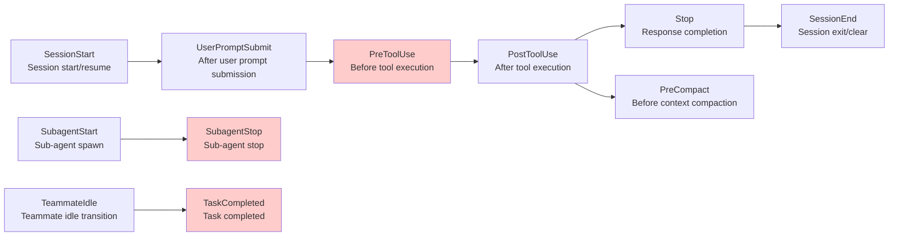

Highlighted nodes represent **blocking** events — able to halt execution with exit code 2 and deliver feedback to Claude.

> **Context Preservation System + Safety Hooks**: This project operates a context preservation system using 5 hooks (`SessionStart`, `PostToolUse`, `Stop`, `PreCompact`, `SessionEnd`), and uses 3 `PreToolUse` hooks to block dangerous commands (Safety Hook), protect TDD test files (TDD Guard), and warn about risky files based on error history (Predictive Debugging) — totaling 8 hook events. When `/clear` or context compaction occurs, work history is automatically saved, and upon starting a new session it is restored via the RLM pattern (pointers + summaries). Dangerous Bash commands (`git push --force`, `git reset --hard`, etc.) are deterministically blocked via regex during PreToolUse. For details, see `.claude/hooks/scripts/`.

**Hook Types (3 Types):**

| Type | Execution Mode | Suitable Use Cases |
|------|----------------|--------------------|
| `command` | Shell script execution | Format validation, security checks, file transformations |
| `prompt` | Single-turn LLM evaluation | API compatibility assessment, lightweight quality checks |
| `agent` | Sub-agent verification (up to 50 turns) | Test suite execution, complex multi-step quality validation |

**Exit Code Rules:**

| Code | Behavior | Usage Timing |
|------|----------|--------------|
| `0` | Pass (Parse JSON output) | Normal execution |
| `2` | Block (stderr → feedback to Claude) | Preventing hazardous actions, sub-standard quality |
| Other | Non-blocking error (Logged only) | Debugging |

**Configuration Hierarchy:**

| Location | Scope | Shareable |
|----------|-------|-----------|
| `~/.claude/settings.json` | Global (all projects) | No |
| `.claude/settings.json` | Project | Yes (committable) |
| `.claude/settings.local.json` | Project (local) | No |
| Agent frontmatter `hooks:` | Agent-scoped | Yes |

### 4.5 Slash Commands — Human Intervention Points

**Design Philosophy:** Slash commands structure **points in the workflow where human judgment is required**. They explicitly delineate reviews, approvals, and choices that cannot be automated.

**Definition Location:** `.claude/commands/*.md`

**Workflow Notation:** Used in conjunction with the `(human)` tag

```markdown
### 3. (human) Review and Select Insights
- **Action**: Select insights to turn into articles
- **Command**: `/review-insights`
```

**Key Patterns:**
- **Review and Proceed**: Display previous step deliverables → approve / reject / request changes
- **Choice-Based Input**: Display options list → select number or item
- **Feedback Loop**: On rejection, deliver concrete feedback to the agent for rework

### 4.5-1 AskUserQuestion — Dynamic User Questions

**Design Philosophy:** While Slash Commands structure **pre-defined** reviews, approvals, and selections, AskUserQuestion handles questions that arise **dynamically during execution**. Used when unpredictable human decisions are needed during workflow execution.

**Comparison with Slash Commands:**

| Attribute | Slash Command | AskUserQuestion |
|-----------|---------------|-----------------|
| **Question Timing** | Pre-defined (explicitly stated in `workflow.md`) | Arises dynamically during execution |
| **Options** | Fixed (defined in command) | Dynamic (generated based on context) |
| **P4 Rules** | Applies | Applies (Max 4 questions, ~3 options each) |
| **Use Case Example** | "Review and Select Insights" | "Select alternative path after agent failure" |

**Suitable Scenarios:**
- When Orchestrator requires user judgment during escalation
- When conditional branching cannot be resolved automatically
- When selecting alternative paths following an agent failure

### 4.6 Skills — Reusable Domain Knowledge Packages

**Design Philosophy:** Skills are reusable modules that encapsulate proven domain knowledge and patterns to apply them consistently. Rather than simple prompt collections, they are structured knowledge packages adhering to the **WHY/WHAT/HOW/VERIFY framework**.

**(Detailed in §7.2)**

### 4.7 MCP Servers — External Service Integration

**Design Philosophy:** Model Context Protocol (MCP) Servers integrate external services (Notion, Slack, databases, etc.) into agent workflows.

**Configuration Location:** `.mcp.json` or `.claude/settings.json`

```json
{
  "mcpServers": {
    "notion": {
      "command": "npx",
      "args": ["-y", "@notionhq/mcp-server"],
      "env": { "NOTION_TOKEN": "${NOTION_TOKEN}" }
    }
  }
}
```

### 4.8 SOT State Management — Write Permission Model

**Design Philosophy (Implementing Absolute Criterion 2):** To prevent data inconsistencies even when dozens of agents operate concurrently, **all shared state is concentrated in a single file** and **write permissions are restricted to a single point**.

**SOT File Structure:**

```yaml
# .claude/state.yaml — Single SOT file
workflow:
  name: "blog-pipeline"
  current_step: 3
  status: "paused"           # running / paused / completed / error
  outputs:
    step-1: "raw-contents.md"
    step-2: "insights-list.md"
  pending_input:
    type: "selection"
    options: [...]
```

**Hierarchical Memory Structure:**

```
Global Memory (SOT — Single File)
  └─ .claude/state.yaml
       ├─ workflow status (current_step, status)
       ├─ step-by-step deliverable paths (outputs)
       └─ error / rollback info

Local Memory (Per-agent — individual working context)
  ├─ Sub-agent: Delegated Task + previous step deliverables (read-only)
  ├─ Teammate: Assigned Task + required input files (read-only)
  └─ Hook: Deliverable under verification (read-only)
```

> **Core Principle:** The Task List (`~/.claude/tasks/`) is a **task assignment and tracking tool**, not workflow state (SOT). Progress states, deliverable paths, and error records must always be managed in the SOT file.

### 4.9 Component Comparison Summary

| Attribute | Sub-agent | Agent Team | Hook | Slash Command | AskUserQuestion | Task System | Skill | MCP Server |
|---|---|---|---|---|---|---|---|---|
| **Role** | Specialist delegation | Parallel collaboration | Automated verification | Human intervention point | Dynamic querying | Task tracking | Knowledge injection | External integration |
| **Session** | Single (delegated) | Multiple (independent) | N/A | N/A | N/A | N/A | N/A | N/A |
| **Context** | Isolated from parent | Fully independent | None | None | Current session | Shared across team | Injected into session | Injected into session |
| **SOT Relation** | Orchestrator updates | Only Team Lead updates | Read-only | Reflects user input | Reflects user input | Separate from SOT | Unrelated | Unrelated |
| **Quality Contribution** | Focused expertise | Multi-perspective parallelism | Deterministic verification | Human judgment | Structured collection | Dependency management | Proven patterns | External data |
| **Suitable Tasks** | Focused, sequential tasks | Parallel collaboration | Validation, formatting, gating | Review, approval, selection | Escalation, branch decisions | Agent Team coordination | Domain knowledge application | External service integration |

### 4.10 Context Preservation System

**Design Philosophy:** When Claude Code's context window is exhausted (`/clear`, context compaction), all ongoing work context is completely lost. By applying the RLM pattern, this system persists work history as an **external memory object** (MD file) and restores it in new sessions using pointer-based referencing.

**RLM Pattern Application:**

The core principle from the RLM paper — "Do not feed prompts directly into the neural network; treat them as objects in an external environment" — is applied to context preservation:

| RLM Concept | Context Preservation Counterpart | Design Rationale |
|---|---|---|
| External Environment Object | `.claude/context-snapshots/latest.md` | Persist snapshots as external files |
| Pointer-based Access | `restore_context.py` outputs pointers + summaries + completion state + Git status | Claude loads full context via Read tool (no direct prompt stuffing) |
| Code-based Filtering | `_context_lib.py` deterministically parses transcripts. Centralizes 10 truncation constants (`EDIT_PREVIEW_CHARS=1000`, `ERROR_RESULT_CHARS=3000`, etc.). Eliminates noise by ordering design decision tags by quality (`[explicit]` > `[decision]` > `[rationale]` > `[intent]`) | P1 Principle: Code refines, AI interprets |
| Variable Persistence | `work_log.jsonl` persistently stores intermediate state (tracks 9 tools) | Accumulates on every tool use, leveraged during snapshot generation |
| Programmatic Exploration | `knowledge-index.jsonl` — searchable via Grep. Contains metadata: `phase`, `phase_flow`, `primary_language`, `error_patterns` (+ `resolution`), `tool_sequence`, `final_status`, `tags`, `session_duration_entries` | Programmatically explore past sessions (corresponds to RLM sub-calls) |
| Error Classification + Resolution Matching | Error Taxonomy (12 patterns) — deterministically categorizes tool errors. Prevents false positives (negative lookahead, qualified matching). **Error→Resolution Matching**: File-aware detection of successful calls within 5 entries after an error → records `resolution` field | P1 Principle: Both error classification and resolution patterns are handled by code |
| Predictive Debugging | `aggregate_risk_scores()` — aggregates Knowledge Archive `error_patterns` per file (weights × decay). SessionStart creates `risk-scores.json` cache → `predictive_debug_guard.py` (PreToolUse) queries cache on every Edit/Write → warns via stderr if threshold exceeded (exit 0). RS1-RS6 P1 validation | L-1 layer utilizing Error Taxonomy (ADR-017) data for **predictive warning**. Warns without blocking → non-disruptive to workflow |
| Multi-Stage Transition Detection | `detect_phase_transitions()` — tracks intra-session phase changes using a sliding window (20 tools, 50% overlap) | Deterministically classifies session structure (research/planning/implementation/orchestration) |
| IMMORTAL-aware Compression | Prioritizes preserving IMMORTAL sections when snapshot size exceeds limit; truncates non-IMMORTAL content first. **Compression Audit Trail**: Records Phase 1–7 deltas in HTML comments | Prevents loss of critical context across session boundaries + enables debugging |
| Resume Protocol | Deterministic restoration instruction section in snapshot. **Dynamic RLM Query Hints**: `extract_path_tags()` extracts path tags → auto-generates custom Grep examples per session | Guarantees quality floor for restoration |
| Path Tag Extraction | `extract_path_tags()` — separates CamelCase/snake_case + extension mapping (`_EXT_TAGS`) to generate language-agnostic search tags | Foundation for Knowledge Archive `tags` field + RLM query hints |
| P1 Hallucination Prevention | KI schema validation (`_validate_session_facts`), partial failure isolation (`archive_and_index_session`), AST-based SOT write pattern validation, SOT schema validation (`validate_sot_schema` — 8 items: S1-S6 basic + S7 pacs 5 fields + S8 active_team 5 fields), **Dangerous command blocking** (`block_destructive_commands.py` — PreToolUse, 8 regex patterns), **Secret detection** (`output_secret_filter.py` — PostToolUse, 3-tier extraction, 25+ patterns), **Security-sensitive file warning** (`security_sensitive_file_guard.py` — PostToolUse, 12 patterns), **Adversarial Review P1 validation** (`validate_review.py` — R1-R5 + pACS Delta + Review→Translation sequence). **131 Safety tests**: 44 (secret) + 44 (sensitive) + 43 (destructive) | Enforces repetitive, precision tasks in code |

**Script Architecture and Data Flow:**

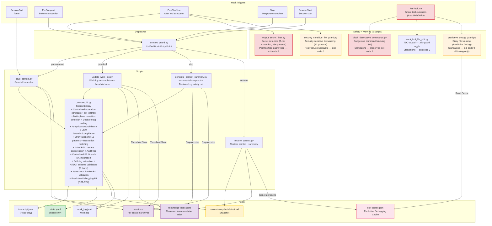

**SOT Compliance (Absolute Criterion 2):**

| Target | Access Permission | Rationale |
|---|---|---|
| `state.yaml` (SOT) | **Read-only** — records SOT state in snapshots without modifying it | Absolute Criterion 2: Only Orchestrator writes to SOT |
| `transcript.jsonl` | **Read-only** — parses conversation history | Claude Code system file; cannot be modified |
| `context-snapshots/` | **Write** — atomic write (temp → rename) | Dedicated Hook output directory, isolated from SOT |
| `work_log.jsonl` | **Write** — append: `fcntl.flock` file locking; truncation (proactive save): atomic write (temp → rename) | Dedicated Hook log, isolated from SOT |
| `knowledge-index.jsonl` | **Write** — `archive_and_index_session()` (invoked from `save_context.py` + `generate_context_summary.py` + `update_work_log.py`). `fcntl.flock` file locking + `os.fsync` durability guarantee. Prevents TOCTOU race (`try/except FileNotFoundError` pattern). KI schema validation (`_validate_session_facts` ensures 11 required keys including `diagnosis_patterns`). Partial failure isolation (archive failure does not block index update) | Cross-session accumulation index, isolated from SOT. Deduplicates by `session_id` (excluding empty IDs/"unknown"). Includes `completion_summary`, `git_summary`, `session_duration_entries`, `phase`, `phase_flow`, `primary_language`, `error_patterns` (Error Taxonomy 12 patterns + resolution matching), `tool_sequence` (RLE compressed), `final_status` (success/incomplete/error/unknown), and `tags` (path-based search tags — CamelCase/snake_case separation + extension mapping) |
| `sessions/` | **Write** — `archive_and_index_session()` (invoked from `save_context.py` + `generate_context_summary.py` + `update_work_log.py`) | Session archive, isolated from SOT |
| `autopilot-logs/` | **Write** — Decision Log safety net (`generate_context_summary.py`, only when Autopilot is active) | Autopilot auto-approval decision log, isolated from SOT |
| `.claude/hooks/setup.init.log` | **Write** — `setup_init.py` (Setup init Hook: Python version, PyYAML, script syntax × 13, directories × 3 (context-snapshots, sessions, 5 runtime dirs), .gitignore, SOT write pattern verification) | Infrastructure validation log, analyzed by `/install` slash command |
| `.claude/hooks/setup.maintenance.log` | **Write** — `setup_maintenance.py` (Setup maintenance Hook) | Health check log, analyzed by `/maintenance` slash command |

**Application of Principle P1 (Data Refinement for Accuracy):**

| Processing | Responsible Entity | Mode |
|---|---|---|
| Transcript parsing, statistics calculation | **Python** (`_context_lib.py`) | Deterministic — no heuristic reasoning |
| System message filtering | **Python** (`_context_lib.py`) | Automatic categorization (e.g., `<system-reminder>`) |
| Snapshot structuring (section placement, compression) | **Python** (`_context_lib.py`) | Verbatim quotes + structured metadata |
| Resume Protocol generation (modified/referenced file lists) | **Python** (`_context_lib.py`) | Deterministic — extracted from `tool_use` metadata |
| Completion state extraction (tool success/failure) | **Python** (`_context_lib.py`) | Deterministic — `tool_use_id` ↔ `tool_result` O(1) dictionary matching |
| Multi-stage transition detection | **Python** (`_context_lib.py`) | Deterministic — sliding window (20 tools, 50% overlap) tracking phase changes |
| Design decision extraction + quality tag sorting | **Python** (`_context_lib.py`) | Deterministic — extracts 4 patterns (`[explicit]`/`[decision]`/`[rationale]`/`[intent]`) sorted by quality |
| Error pattern categorization + resolution matching (Error Taxonomy) | **Python** (`_context_lib.py`) | Deterministic — 12 regex patterns classify error types. False-positive prevention. Error→Resolution matching: file-aware detection of successful calls within 5 entries after error |
| Path tag extraction | **Python** (`_context_lib.py`) | Deterministic — `extract_path_tags()` CamelCase/snake_case splitting + `_EXT_TAGS` extension mapping |
| KI schema validation | **Python** (`_context_lib.py`) | Deterministic — `_validate_session_facts()` guarantees 11 required keys (safe defaults on omission, includes `diagnosis_patterns`) |
| SOT schema validation | **Python** (`_context_lib.py`) | Deterministic — `validate_sot_schema()` validates 8 structural integrity items (S1-S6 basic + S7 pacs 5 fields (`dimensions`, `current_step_score`, `weak_dimension`, `history`, `pre_mortem_flag`) + S8 active_team 5 fields (`name`, `status(partial|all_completed)`, `tasks_completed`, `tasks_pending`, `completed_summaries`)) |
| pACS P1 validation | **Python** (`_context_lib.py` + `validate_pacs.py`) | Deterministic — `validate_pacs_output()` PA1-PA6 validates pACS log structural integrity (file existence, minimum size, dimension scores 0-100, Pre-mortem presence, `min()` arithmetic, Color Zone alignment) |
| L0 Anti-Skip Guard | **Python** (`_context_lib.py` + `validate_pacs.py`) | Deterministic — `validate_step_output()` L0a-L0c validates deliverable physical existence (path from SOT outputs, file existence, ≥100 bytes, non-empty) |
| Team Summaries KI preservation | **Python** (`_context_lib.py`) | Deterministic — `_extract_team_summaries()` preserves SOT `active_team.completed_summaries` in Knowledge Archive (prevents loss during snapshot rotation) |
| Tool sequence compression (RLE) | **Python** (`_context_lib.py`) | Deterministic — Run-Length Encoding compresses tool call sequences (e.g., `Read(3)→Edit→Bash`) |
| System command filtering | **Python** (`_context_lib.py`) | Deterministic — excludes system commands like `/clear`, `/help` from "current work" extraction |
| Git state capture | **Python** (`_context_lib.py`) | Deterministic — executes Git commands via `subprocess.run` |
| Programmatic exploration of cross-session index | **AI** (Claude) | Search `knowledge-index.jsonl` using Grep tool |
| Interpreting restored snapshots, understanding context | **AI** (Claude) | Loads snapshot via Read tool, then performs semantic interpretation |

**Safety Guarantees:**

- **Atomic write**: All file writes (snapshots, archives, work_log truncation) use temp file → `os.rename` pattern, preventing exposure of partial states and incomplete writes during process crashes.
- **Smart Throttling**: Stop hook uses a 30-second dedup window + 5KB growth threshold to reduce noise. SessionEnd/PreCompact use a 5-second window. SessionEnd is exempt from dedup.
- **E5 Empty Snapshot Guard**: Protects rich `latest.md` files from being overwritten by empty snapshots via multi-signal detection (size ≥ 3KB OR ≥ 2 section markers). Enforced across both Stop hook and `save_context.py` using centralized `is_rich_snapshot()` + `update_latest_with_guard()` functions.
- **IMMORTAL-aware Compression**: Prioritizes preserving IMMORTAL sections during Phase 7 hard truncation. Cuts non-IMMORTAL content first, and even in extreme cases retains the opening portion of IMMORTAL text to prevent losing core context. **Compression Audit Trail**: Records characters removed per phase in HTML comments (`<!-- compression-audit: ... -->`) at the end of the snapshot (Phase 1–7 deltas + final size).
- **File locking**: Employs `fcntl.flock` file locking + `os.fsync()` durability guarantees when accessing `work_log.jsonl` (append) and `knowledge-index.jsonl` to ensure concurrency protection. `work_log.jsonl` truncation (proactive save) applies atomic write patterns.
- **TOCTOU race prevention**: Uses a `try/except FileNotFoundError` pattern instead of `os.path.exists()` checks during creation and updating of `knowledge-index.jsonl`, fundamentally eliminating race conditions.
- **Session dedup protection**: Skips deduplication if `session_id` is an empty string or `"unknown"`, preventing data loss.
- **SOT path unification**: Manages SOT file paths from a single definition point using the `sot_paths()` helper and `SOT_FILENAMES` constant (eliminating 3-fold hardcoding).
- **Centralized truncation constants**: 10 truncation constants (`EDIT_PREVIEW_CHARS`, `ERROR_RESULT_CHARS`, `MIN_OUTPUT_SIZE`, etc.) are centrally defined in `_context_lib.py` to maintain consistent snapshot quality.
- **Non-blocking vs. Blocking distinction**: Context Preservation hooks return exit code 0 (non-blocking). Among Safety Hooks, `block_destructive_commands.py` and `output_secret_filter.py` **block** with exit code 2. The remainder (`predictive_debug_guard.py`, `security_sensitive_file_guard.py`) return exit code 0 (warning only).
- **Knowledge Archive rotation**: Retains up to 200 entries in `knowledge-index.jsonl` and up to 20 files in `sessions/`.

**Hook Configuration Integration (Project-only):**

All hooks are unified in `.claude/settings.json` (Project) and applied automatically upon `git clone`.

| Event Group | Hook Event | Script |
|-------------|------------|--------|
| Context Preservation | Stop, PostToolUse, PreCompact, SessionStart | `context_guard.py` → dispatches to 4 specialized scripts |
| Safety (PreToolUse) | PreToolUse (Bash) | `block_destructive_commands.py` (standalone execution) |
| TDD Guard | PreToolUse (Edit\|Write) | `block_test_file_edit.py` (standalone execution) |
| Predictive Debug | PreToolUse (Edit\|Write) | `predictive_debug_guard.py` (standalone execution) |
| Safety (PostToolUse) | PostToolUse (Bash\|Read) | `output_secret_filter.py` (3-tier secret detection, standalone execution) |
| Security Guard | PostToolUse (Edit\|Write) | `security_sensitive_file_guard.py` (security-sensitive file warning, standalone execution) |
| Session Lifecycle | SessionEnd, Setup (init/maintenance) | `save_context.py`, `setup_init.py`, `setup_maintenance.py` |

---

## 5. Design Principles

> **Note on Reference Numbers**: Section 5.x in this document addresses Design Principles (P1~P4 + cross-cutting concerns). References to `§5.1 Autopilot`, `§5.3 Verification`, and `§5.4 pACS` in Spoke files or `SKILL.md` refer to **AGENTS.md §5.x** (implementation elements).

Design principles are subordinate to the Absolute Criteria. While Absolute Criteria define "what to optimize for," Design Principles define "how to optimize."

### 5.1 P1: Data Refinement for Accuracy

Passing raw, large-scale data directly to AI degrades accuracy through noise.

```
                     ┌─────────────────┐
 Raw Data ─────────→│ Pre-processing  │──── Refined Data ────→ AI Agent
 (HTML, JSON, CSV)   │ (Python script) │                      (Judgment, Analysis, Generation)
                     └─────────────────┘
                                                                    │
                     ┌─────────────────┐                            ▼
 Final Deliverable ← │ Post-processing │←─── Agent Deliverable
                     │ (Deduplication) │
                     └─────────────────┘
```

**Division of Responsibility:**

| Processing Type | Responsible Entity | Example |
|---|---|---|
| Data filtering (date, keyword) | **Code** (Python) | Date range filter, keyword matching |
| Deduplication (hash, similarity) | **Code** (Python) | MD5 hash, cosine similarity |
| Format conversion (HTML→Text) | **Code** (Python) | BeautifulSoup, regex |
| Relationship computation (statistics) | **Code** (Python) | Frequency analysis, graph construction |
| Semantic analysis, judgment, summarization | **AI Agent** | Insight extraction, core summarization |
| Creative generation, writing | **AI Agent** | Content authoring, idea ideation |

This principle corresponds directly to the "Code-based Filtering" pattern in the RLM paper. By removing noise through deterministic computation (Python), probabilistic inference (LLM) can focus its reasoning solely on clean data.

```
Bad:  "Pass the entire collected web page HTML to the agent"
Good: "Extract only body text via Python script → pass only essential text to the agent"
```

### 5.2 P2: Expertise-Based Delegation Structure

Maximize quality by delegating each task to specialized agents best suited to perform it. The Orchestrator coordinates overarching quality, while specialized agents focus deeply on their respective domains.

```
Orchestrator (Quality Coordination + Flow Management)
  ├→ Agent A: Specialized Research (optimized for target domain)
  ├→ Agent B: In-depth Analysis (focused purely on analysis)
  └→ Agent C: Verification and Quality Gate
```

**Core Principle:** Having the Orchestrator "do everything" is an anti-pattern. The Orchestrator is a coordinator; execution belongs to specialized agents.

### 5.3 P3: Resource Accuracy

In stages requiring images, files, or external resources, **specify exact paths**. Placeholders may not be omitted.

```
Bad:  "Download and use an appropriate image"
Good: "Download https://example.com/chart-2024.png → save to assets/chart.png"
```

### 5.4 P4: Question Design Rules

Strict rules when querying the user:
- **Maximum of 4 questions**
- Provide approximately **3 options** per question
- If there is no ambiguity, **proceed without questions**

This principle minimizes user fatigue while accurately collecting necessary information.

### 5.5 English-First Execution and Translation Protocol

During workflow **execution**, all agents **work in English** and generate **deliverables in English**. Because AI exhibits peak reasoning performance in English, English-first execution is a direct manifestation of **Absolute Criterion 1 (Quality)**.

**Language Boundaries:**

| Activity | Language | Rationale |
|----------|----------|-----------|
| Workflow Design (`workflow-generator` skill) | Korean / User Native Language | Dialogue with user |
| Agent Definitions (`.claude/agents/*.md`) | English | Maximize agent prompt quality |
| Workflow Execution (Agent operations) | **English** | Maximize AI reasoning performance |
| Final Deliverables | English primary + Localized translation | Secure both quality and accessibility |

**Translation Protocol:**

- The `@translator` sub-agent translates English deliverables of each step into Korean or the target language.
- `translations/glossary.yaml` acts as an RLM external persistent state to ensure terminology consistency.
- `memory: project` implicitly accumulates style and tone patterns, forming a 2-tier memory with `glossary.yaml` (ADR-051).
- Record translation paths in SOT under `step-N-ko` keys (`.isdigit()` guard skips them automatically).

This design corresponds to the Variable Persistence pattern from RLM: the glossary serves as an external environment object preserving state across sub-agent invocations.

> **Details**: See `AGENTS.md §5.2`.

### 5.6 Verification Protocol (Task Verification)

A protocol verifying that deliverables at each workflow stage achieve **100% of their functional goals**. This represents post-hoc enforcement of P1 (Data Refinement) and direct execution of Absolute Criterion 1 (Quality).

**Core Principle:** "Declare the definition of done beforehand, verify after execution, and re-execute upon failure."

**2-Layer Quality Assurance Architecture:**

```
Quality Assurance Layers:

  Anti-Skip Guard (Hook — Deterministic)
    "Does the file exist, and does it have a meaningful size?"
      ↓ PASS
  Verification Gate (Agent — Semantic)
    "Are the functional goals 100% achieved?"
      ↓ PASS
  SOT Update + Proceed to Next Stage
```

The Anti-Skip Guard guarantees **physical existence**, while the Verification Gate ensures **content completeness**. Both layers operate independently; both must pass before advancing to the next step.

**4 Types of Verification Criteria:**

| Type | Verification Target | Example |
|---|---|---|
| **Structural Completeness** | Internal structure of deliverable | "All 5 sections must be present" |
| **Functional Goal** | Achievement of task objectives | "At least 3 tiers per competitor + exact pricing" |
| **Data Integrity** | Accuracy of data | "All URLs valid, no placeholders" |
| **Pipeline Interoperability** | Compatibility with next step input | "Contains all fields required by Step 4" |

**Execution Flow:**

```
1. Read Verification criteria (before Task)
2. Execute step (Absolute Criterion 1 — complete quality)
3. Anti-Skip Guard (deterministic)
4. Verification Gate (semantic self-verification)
   ├─ All criteria PASS → verification-logs/step-N-verify.md → SOT update
   └─ FAIL → re-execute failed portion only (up to 10 retries) → escalate to user if exceeded
```

**Team Stage 3-Layer Verification:**

| Layer | Performer | Verification Target | SOT Write |
|---|---|---|---|
| **L1** | Teammate (Self-verification) | Own task verification criteria | None (contained within session) |
| **L1.5** | Teammate (pACS) | Confidence in own task deliverable | None (included in report message) |
| **L2** | Team Lead (Comprehensive verification + Step pACS) | Verification criteria for entire step | Yes (updates SOT outputs + pacs) |

**Backward Compatibility:** Steps without a `Verification` field proceed with the Anti-Skip Guard only. Mandatory for all newly generated workflows.

**RLM Pattern Mapping:** `verification-logs/` represents external memory objects corresponding to RLM Variable Persistence. By persisting verification results to files, tracking across session boundaries is guaranteed.

> **Details**: See `AGENTS.md §5.3`.

### 5.7 pACS — predicted Agent Confidence Score (Self-Confidence Evaluation)

An **agent self-confidence evaluation protocol** inspired by AlphaFold's pLDDT (predicted Local Distance Difference Test). While the Verification Protocol guarantees "completeness," pACS quantifies **"confidence."**

**Core Mechanisms:**

| Component | Description |
|---|---|
| **3-Dimensional Evaluation** | F (Factual Grounding), C (Completeness), L (Logical Coherence) — 3 orthogonal dimensions |
| **Min-Score Principle** | `pACS = min(F, C, L)` — worst-case baseline, not weighted average |
| **Pre-mortem Protocol** | Mandatory 3 weakness questions prior to scoring — structurally eliminates score inflation |
| **Behavioral Triggers** | GREEN (≥70 auto-proceed), YELLOW (50-69 flag & proceed), RED (<50 rework) |
| **Translation pACS** | Ft (Fidelity), Ct (Completeness), Nt (Naturalness) — dedicated to translation quality |

**4-Layer Quality Assurance Architecture:**

```
L0   Anti-Skip Guard (Deterministic)    — File existence + ≥ 100 bytes
L1   Verification Gate (Semantic)       — 100% functional goal achievement
L1.5 pACS Self-Rating (Confidence)      — Pre-mortem + F/C/L scoring
L2   Adversarial Review (Enhanced)      — @reviewer / @fact-checker adversarial review (§5.5 of AGENTS.md)
```

**Design Decision — "Why min-score instead of weighted average?":**

When an agent self-evaluates without calibration data and calculates a weighted average across multiple dimensions, a **precision illusion** occurs. Though subjectively estimated, the score deceptively suggests decimal-point precision. Min-score operates on the conservative principle that "the weakest link dictates overall quality," preventing overconfidence. This mirrors AlphaFold, where the residues with the lowest confidence determine the overall utility of the structural model.

**Design Decision — "Why is Pre-mortem mandatory?":**

Agent self-evaluations are inherently vulnerable to confirmation bias. The Pre-mortem Protocol forces explicit recognition of weaknesses **prior to** scoring, transforming the default framing from "everything went well" to **"where is uncertainty hiding?"**.

**RLM Pattern Mapping:** Like verification logs, `pacs-logs/` embodies RLM Variable Persistence. The SOT `pacs.history` field tracks pACS trends across sessions, enabling identification of persistently weak dimensions (e.g., F consistently lowest) in specific workflows to serve as empirical grounds for structural improvements.

> **Details**: See `AGENTS.md §5.4`.

---

## 6. Execution Patterns

5 standard execution patterns created by combining components:

### Pattern 1: Sequential Pipeline (Sub-agent Sequential)

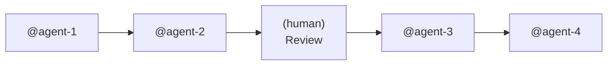

**Quality Rationale:** Deep context retention by a single expert elevates consistency and precision.

**Suitable Scenarios:**
- Accuracy of inter-stage context passing is vital to deliverable quality.
- Strong sequential dependencies where earlier stage quality directly dictates downstream quality.

### Pattern 2: Parallel Branches (Agent Team Parallel)

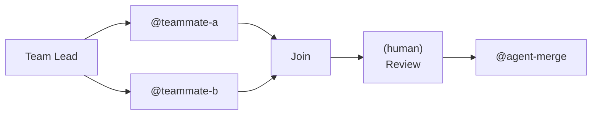

**Quality Rationale:** Independent focus by each specialist + multi-perspective synthesis delivers richer quality than a single agent.

**Suitable Scenarios:**
- Disparate domains requiring deep, independent handling.
- Need for multi-angle analysis and cross-verification.

### Pattern 3: Conditional Flow (Conditional Branching)

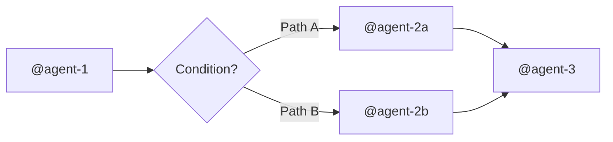

**Suitable Scenarios:**
- Diverging execution paths based on preceding step outputs.
- Branching based on data types, quality tiers, or user selections.

### Pattern 4: Hook-Gated Pipeline (Automated Verification Gate)

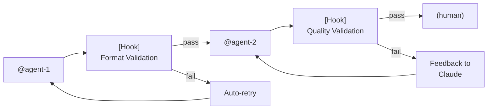

**Quality Rationale:** Automatically applies repeatable quality standards via deterministic validation.

**Suitable Scenarios:**
- Code quality, security validation, and deliverable standard compliance are critical.
- Repetitive verification items unsuitable for manual human inspection every turn.

### Pattern 5: Team + Hook Combination (Advanced Hybrid)

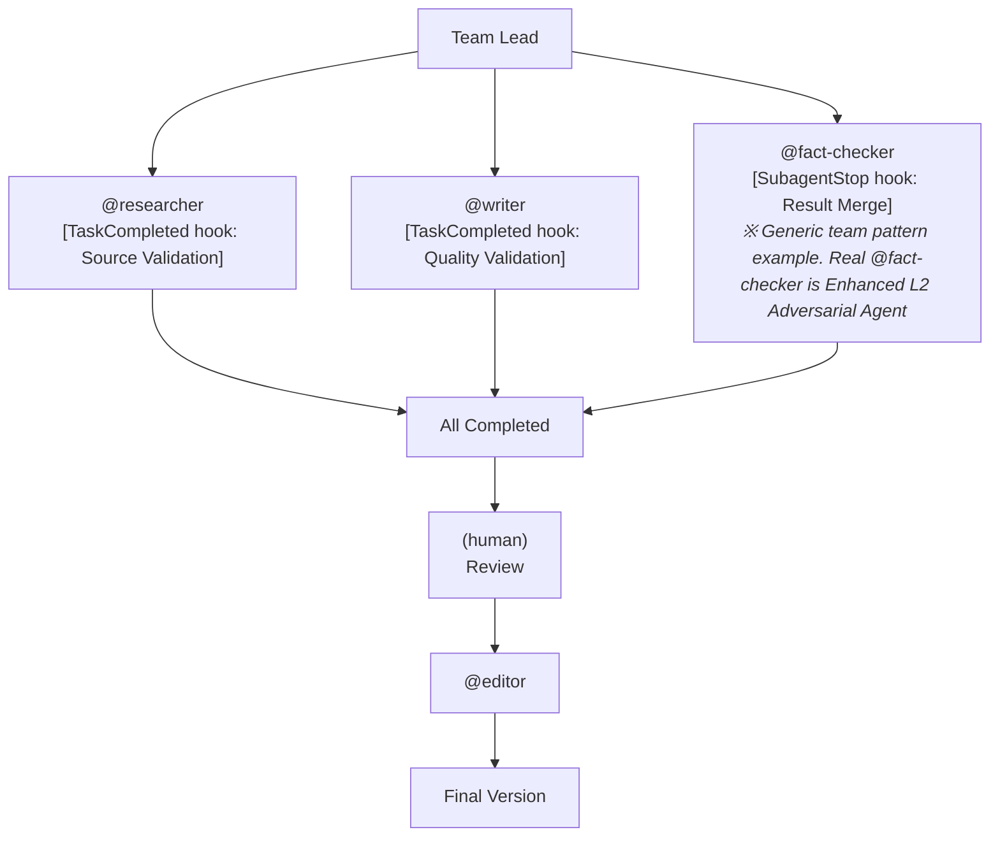

**Quality Rationale:** Triple-layer quality guarantee combining parallel expert execution, automated quality gates, and human review.

**Suitable Scenarios:**
- Highest quality requirements in complex workflows.
- Independent quality standards required for each specialist's deliverable.

### Autopilot Mode (Auto-Approval Execution Mode)

An **execution mode** applicable across all 5 patterns above. When Autopilot is active, `(human)` steps are auto-approved.

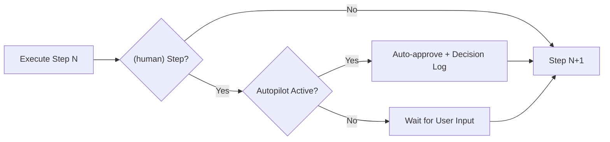

**Core Invariant:** `(hook)` quality gates still block even under Autopilot. All steps are fully executed. All deliverables must meet full quality standards.

**Anti-Skip Guard + Verification Gate + pACS + Adversarial Review (4-Layer Quality Assurance):**

Up to 4 verification layers performed by the Orchestrator upon step completion:

```
L0: Anti-Skip Guard (Deterministic)
  1. Is deliverable file recorded as a path in SOT outputs?
  2. Does the file physically exist on disk?
  3. Is file size at least 100 bytes?

L1: Verification Gate (Semantic — only for steps with Verification field)
  4. Does deliverable satisfy 100% of Verification criteria?
  5. If any criteria fail, re-execute that portion only (up to 10 retries)
  6. Record results in verification-logs/step-N-verify.md

L1.5: pACS Self-Rating (Confidence — after passing Verification)
  7. Pre-mortem Protocol → F/C/L 3-dimension scoring → pACS = min(F, C, L)
  8. Record in pacs-logs/step-N-pacs.md

L2: Adversarial Review (Enhanced — only for steps with Review: field specified)
  9. @reviewer / @fact-checker conduct independent adversarial review
  10. P1 validation (validate_review.py) guarantees review rigor
  11. Record in review-logs/step-N-review.md
```

> Steps lacking a `Verification` field proceed with L0 (Anti-Skip Guard) only (backward compatibility). Details: §5.6, `AGENTS.md §5.3~§5.5`.
>
> **Abductive Diagnosis Layer**: When a quality gate (Verification/pACS/Review) fails, a 3-step structured diagnosis is executed prior to retrying. Step A: P1 pre-evidence gathering (`diagnose_context.py` — retry history, upstream evidence, hypothesis priority, fast-path determination), Step B: LLM root cause analysis (compares ≥ 2 hypotheses), Step C: P1 post-validation (`validate_diagnosis.py` AD1-AD10 structural integrity). Fast-Path (FP1: simple omission, FP2: established fix pattern, FP3: repeated failures → escalation) allows deterministic short-circuiting. Diagnostic logs are recorded in `diagnosis-logs/step-N-{gate}-{timestamp}.md` and archived into Knowledge Archive under `diagnosis_patterns`. Details: `AGENTS.md §5.6`.

**Decision Log:**

Auto-approved decisions are recorded in `autopilot-logs/step-N-decision.md` (ensuring transparency):
- Required fields: `step_number`, `checkpoint_type`, `decision`, `rationale`, `timestamp`
- Standard template: `.claude/skills/workflow-generator/references/autopilot-decision-template.md`

**Runtime Enforcement Architecture (Claude Code Implementation):**

A hybrid system (Hook + Prompt) enforcing Autopilot design intent at runtime:

```
                  ┌─── Hook Layer (Deterministic) ───┐
                  │                                  │
SessionStart ─────→ Re-inject Autopilot rules        │  ← Re-inject rules across session boundaries
                  │ + Prior step output verification │
                  │                                  │
Stop ─────────────→ Detect/remedy missing Decision   │  ← Regex detection of auto-approval patterns
                  │   Logs                           │
                  │                                  │
Snapshot ─────────→ IMMORTAL preservation of state   │  ← Prevent loss across session boundaries
                  │                                  │
PostToolUse ──────→ Track autopilot_step progress   │  ← Record in work_log.jsonl
                  └──────────────────────────────────┘

                  ┌─── Prompt Layer (Behavioral Guidance) ─┐
                  │                                        │
                  │  autopilot-execution.md Checklist       │
                  │  Mandatory actions at start/exec/done  │
                  └────────────────────────────────────────┘
```

> **SOT Compliance**: The Hook layer accesses the SOT (`state.yaml`) strictly read-only. Writes are performed exclusively to `context-snapshots/` and `autopilot-logs/` (adhering to Absolute Criterion 2).

Details: `AGENTS.md §5.1`.

### ULW Mode (Thoroughness Intensity Overlay)

ULW is a **thoroughness intensity overlay orthogonal to Autopilot**.

**2x2 Matrix:**

| | **ULW OFF** | **ULW ON** |
|---|---|---|
| **Autopilot OFF** | Standard interactive | Interactive + Sisyphus Persistence (3 retries) + Mandatory Task Decomposition |
| **Autopilot ON** | Standard automated workflow | Automated workflow + Sisyphus reinforcement (3 retries) |

**2-Axis Comparison:**

| Axis | Concern | Activation | Deactivation |
|------|---------|------------|--------------|
| **Autopilot** | Automation (HOW) | SOT `autopilot.enabled: true` | SOT modification |
| **ULW** | Thoroughness (HOW THOROUGHLY) | `ulw` in prompt | Implicit (on new session) |

**3 Reinforcement Rules (Intensifiers):**
1. **I-1. Sisyphus Persistence** — Up to 3 retries, each attempting a distinct approach.
2. **I-2. Mandatory Task Decomposition** — `TaskCreate` → `TaskUpdate` → `TaskList` lifecycle mandatory.
3. **I-3. Bounded Retry Escalation** — Do not exceed 3 retries on the same target (Quality Gates have separate retry budgets).

**Deterministic Reinforcement (Claude Code Implementation):**

```
                  ┌─── Hook Layer (Deterministic) ───┐
                  │                                  │
detect_ulw_mode ──→ Transcript regex detection       │  ← Word-boundary false-positive prevention
                  │                                  │
Snapshot ─────────→ IMMORTAL preservation of state   │  ← Prevent loss across session boundaries
                  │                                  │
SessionStart ─────→ Inject ULW reinforcement rules   │  ← On clear/compact/resume
                  │ (except startup — implicit reset)│
                  │                                  │
Stop ─────────────→ Compliance Guard verification   │  ← Deterministic check of 3 intensifiers
                  │ + ULW safety net (stderr warning)│
                  │ + Knowledge Archive tagging      │
                  └──────────────────────────────────┘
```

> **Combination with Autopilot**: ULW **amplifies** Autopilot — elevates quality gate retry limits from 10 to 15. Safety Hook blocking is always respected.

Details: `docs/protocols/ulw-mode.md`.

---

## 7. Documentation Architecture

### 7.1 Separation of Concerns Across Files

The documentation system in this project follows an **intentionally designed hierarchy**:

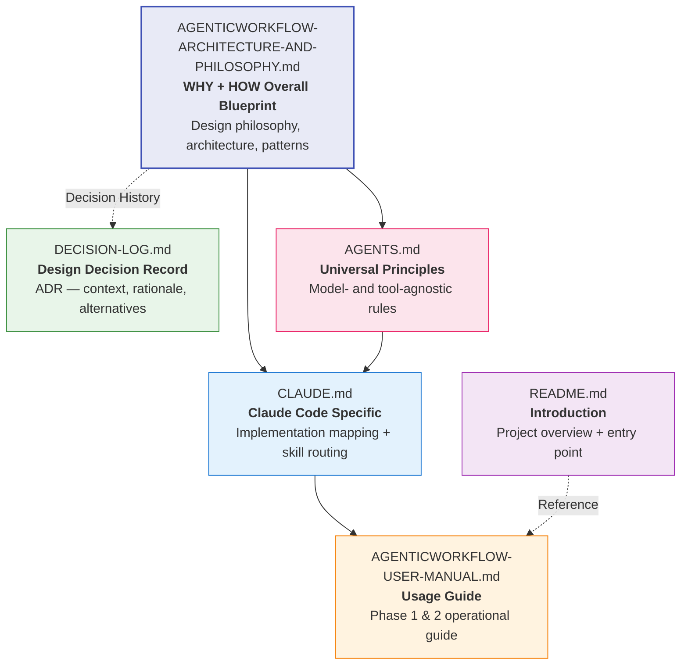

**Role of Each File:**

| File | Target Audience | Question Answered | Reference Frequency |
|---|---|---|---|
| **ARCHITECTURE** | Architects, new contributors | "Why was it designed this way?" | Initial onboarding |
| **DECISION-LOG** | Architects, future decision-makers | "When and why was that decision made?" | Tracing decisions |
| **AGENTS.md** | All AI agents | "What rules apply regardless of model or tool?" | Every session |
| **CLAUDE.md** | Claude Code | "How is this implemented using Claude Code features?" | Every session |
| **USER-MANUAL** | Users (Humans) | "How do I operate this tool?" | As needed |
| **README.md** | First-time visitors | "What is this project?" | First encounter |

**Hub-and-Spoke System Prompt Architecture:**

This project is engineered so that **regardless of which AI CLI tool is used**, the same methodology is automatically applied. `AGENTS.md` is the methodology SOT (Hub), and each tool-specific file acts as a Spoke:

```
                AGENTS.md (Hub — Methodology SOT)
               /    |    |    \    \               CLAUDE  GEMINI .cursor  .github/
          .md     .md    /rules   copilot-
                         (Spoke)  instructions.md
```

| AI CLI Tool | Spoke File | Auto-read |
|---|---|---|
| Claude Code | `CLAUDE.md` | Yes |
| Gemini CLI | `GEMINI.md` (+ `@AGENTS.md` import) | Yes |
| Codex CLI | `AGENTS.md` directly | Yes |
| Copilot CLI | `.github/copilot-instructions.md` | Yes |
| Cursor | `.cursor/rules/agenticworkflow.mdc` | Yes (alwaysApply) |

Each Spoke file serves two roles:
1. **Inlined Absolute Criteria + Detailed Reference**: Inlines core definitions while referencing `AGENTS.md` for details.
2. **Tool-Specific Implementation Mapping**: Maps native tool features to AgenticWorkflow concepts.

**Relationship Between AGENTS.md and Spoke Files:**

Absolute Criteria and Design Principles across all Spoke files are **identical** to `AGENTS.md`. The only difference is the specificity of implementation mappings:

| Category | AGENTS.md (Hub) | CLAUDE.md (Spoke Example) |
|---|---|---|
| Absolute Criteria | Original definition | Inlined duplicate + reference |
| Design Principles P1-P4 | Original definition | Inlined duplicate + reference |
| Implementation Element Names | "Specialist Agent", "Agent Group", "Automated Verification" | "Sub-agent", "Agent Team", "Hooks" |
| Configuration Examples | None (tool-agnostic) | `.claude/agents/*.md`, `.claude/settings.json` |
| Context Preservation | Principles defined only | Hook-based automated system (Claude Code specific) |

> **In Case of Conflict:** Absolute Criteria in `AGENTS.md` supersede all Spokes. Principles stand above tool-specific implementations.
> **Synchronization Mandate:** When Absolute Criteria in `AGENTS.md` change, inlined duplicates across all Spokes must be updated synchronously.

### 7.2 Internal Architecture of Skills: WHY/WHAT/HOW/VERIFY Framework

All skills adhere to the design pattern of **separation of concerns across files**. This is an **intentional design**, not an accident:

```
SKILL.md (WHY — Why this skill exists)
  ├── Domain contextualization of Absolute Criteria
  ├── Core principles and evaluation criteria
  └── Workflow (Sequence of application)

references/ (WHAT/HOW/WHERE/VERIFY)
  ├── WHAT — What it addresses (Problem catalogs, analysis checklists)
  ├── HOW — How to resolve (Implementation patterns, revision examples)
  ├── WHERE — Where to apply (Discipline guides, language guides)
  └── VERIFY — How to verify (Checklists, evaluation criteria)
```

**workflow-generator Division of Responsibility:**

| File | Role | Usage Timing |
|---|---|---|
| `SKILL.md` | **WHY** — Raison d'être of skill, case branches, Absolute Criteria | Entry point on every execution |
| `workflow-template.md` | **WHAT** — Standard structure of workflow.md + notation | Phase 1: Workflow creation |
| `claude-code-patterns.md` | **HOW** — Sub-agent, Team, Hook implementation patterns | Phase 2: Implementation design |
| `document-analysis-guide.md` | **WHAT** — Document analysis checklist (6 extraction categories) | Phase 1 Case 2: Document analysis |
| `context-injection-patterns.md` | **HOW** — Context injection pattern guide | Phase 2: Agent prompt design |
| `autopilot-decision-template.md` | **VERIFY** — Autopilot Decision Log standard template | Record decisions in Autopilot mode |
| `state.yaml.example` | **WHAT** — SOT file structure example + field descriptions | Phase 2: SOT initialization |

**doctoral-writing Division of Responsibility:**

| File | Role | Usage Timing |
|---|---|---|
| `SKILL.md` | **WHY** — 4 core principles, Absolute Criteria, 5-stage workflow | Entry point on every execution |
| `common-issues.md` | **WHAT** — 10 common issue catalogs + Before/After | Pattern identification |
| `before-after-examples.md` | **HOW** — Actual dissertation revision case studies | Concrete revision examples |
| `academic-quick-reference.md` | **HOW (Academic Patterns)** — Academic paper pattern library | Quick reference and pattern transformation |
| `discipline-guides.md` | **WHERE** — Conventions across humanities, social sciences, natural sciences | Discipline-specific questions |
| `clarity-checklist.md` | **VERIFY** — Systematic evaluation of clarity, conciseness, rigor | Verification after revision |

### 7.3 Principle of Intentional Duplication

Certain concepts (e.g., active vs. passive voice, sentence length rules) appear across multiple files. This is not a design flaw, but **intentional duplication**:

| Manifestation of Same Concept | Access Pattern | Reader Need |
|---|---|---|
| "Active voice preference principle" in `SKILL.md` | Learning principles | "Why prefer active voice?" |
| "Passive voice overuse + Before/After" in `common-issues.md` | Problem solving | "How do I fix passive voice in my sentence?" |
| "Active/passive voice checklist item" in `clarity-checklist.md` | Verification | "Does this sentence use an appropriate voice?" |
| "Natural science methods section passive voice convention" in `discipline-guides.md` | Exception handling | "Is passive voice conventional in this discipline?" |

**Design Philosophy:** Even for identical knowledge, differing access objectives (learning / solving / verifying / exception handling) require **expression in different forms**. This is intentional replication for multi-faceted access, not redundant duplication.

---

## 8. Prompt Resource Architecture

The 3 files in the `prompt/` directory serve as independent resources used across different phases and purposes:

### 8.1 Roles and Timing of Resources

| Resource | Role | Phase | Usage Timing |
|---|---|---|---|
| `crystalize-prompt.md` | Prompt compression | Phase 2 | When sub-agent prompts grow excessively long |
| `distill-partner.md` | Essence extraction interview | Phase 1 (Distill verification) | Verifying quality of generated workflow.md |
| `crawling-skill-sample.md` | Defensive crawling skill sample | Phase 2 | Structural reference when authoring new skill files |

### 8.2 crystalize-prompt: Agent Instruction Compression

A meta-prompt that compresses verbose AI agent instructions without semantic loss.

**5 Core Compression Principles:**
1. **Intent Preservation**: Preserve the WHY behind each instruction.
2. **High-Resolution Tokenization**: Replace long explanations with domain-specific conceptual references.
3. **Implicit Knowledge Leverage**: Activate existing LLM knowledge through high-density signals.
4. **Conditional Deployment**: Utilize `[condition] → [action]` patterns.
5. **Deduplication**: Merge distinct expressions conveying identical intent.

**Role in AgenticWorkflow:** When multiple agents in an Agent Team each possess their own prompts, this tool boosts token efficiency while preserving instruction precision.

### 8.3 distill-partner: Scope Reduction + Automation Discovery

Extracts the core essence of work via a 4-stage interview framework:

```
Step 1: Understand Context
Step 2: "What is absolutely essential?"  → Core Concepts (Preserve)
Step 3: "What can be eliminated?"         → Elimination Targets (Remove)
Step 4: "What can be automated/repeated?" → Automation Opportunities (Script)
```

**Role in AgenticWorkflow:** Serves as a **Distill verification** tool interrogating generated `workflow.md`: "Does this stage contribute to quality?", "Does automating this improve stability?", "Are there missing quality enhancement stages?" Corresponds to post-processing verification under Absolute Criterion 1 (Quality Maximization).

### 8.4 crawling-skill-sample: Defensive Agent-Tool Interaction

A defensive crawling framework for Naver News. Serves as a **structural reference for skill files**, not just a simple code sample:

- **Strategy Escalation Pattern**: default → header rotation → delay increase → proxy rotation → browser emulation
- **Observability**: Logging block categories and success patterns
- **Graceful Degradation**: Automatically switches to next strategy upon failure

This pattern is equally applicable to **error handling design** in agent workflows: agent failure → retry → alternative agent → human intervention.

---

## 9. Notation System

The notation system used in `workflow.md` consists of 6 markers. Rather than simple markdown conventions, this notation represents a **design language conveying execution semantics**:

| Notation | Meaning | Execution Semantics | Implementation Mapping |
|---|---|---|---|
| `(human)` | Human intervention/review required | Auto-pause, wait for user input | Resumed via Slash Command |
| `(team)` | Agent Team parallel execution block | Team creation, parallel task distribution, Join | `TeamCreate` + `TaskCreate` |
| `(hook)` | Automated verification / quality gate | Pass/block determined by exit code | `settings.json` Hook configuration |
| `@agent-name` | Sub-agent invocation | Perform specialized task in isolated session | `.claude/agents/*.md` |
| `/command-name` | Slash command execution | Trigger user interaction | `.claude/commands/*.md` |
| `[skill-name]` | Skill reference | Inject domain knowledge package | `.claude/skills/*/SKILL.md` |

**Design Intent of Notation:**

Engineered so that **reading the notation alone reveals the execution model**:

```markdown
### 2. (team) Parallel Research
- **Tasks**:
  - `@researcher`: Collect latest trends from web sources
  - `@data-processor`: Organize existing data and statistical analysis
- **Join**: Advance to Step 3 after all teammates complete
```

From this single block, one immediately reads:
- `(team)` → Parallel execution, independent sessions
- `@researcher`, `@data-processor` → Individual Sub-agent definitions required
- **Join** → Confluence condition when all teammates finish

---

## 10. Extension Points

### 10.1 Mandatory Requirements when Adding New Skills

Skill development rules consist of **4 mandatory requirements**:

| # | Mandatory Requirement | Rationale |
|---|---|---|
| 1 | **Must include all Absolute Criteria** — contextualized to the target domain (Absolute Criterion 3 may be N/A for non-coding domains) | Skills must align with the project value system |
| 2 | **Separation of concerns across files** — `SKILL.md` (WHY), `references/` (WHAT/HOW/VERIFY) | Maintain consistency in the WHY/WHAT/HOW/VERIFY framework |
| 3 | **Explicitly detail conflict scenarios between Absolute Criteria** | Practical judgment criteria are more effective than abstract rules |
| 4 | **Mandatory reflection after modification** | Do not just insert text; actually examine potential conflicts with existing content |

**New Skill Directory Structure:**

```
.claude/skills/[skill-name]/
├── SKILL.md                    ← WHY (Entry point)
│   ├── Absolute Criteria Domain Contextualization
│   ├── Core Principles
│   ├── Conflict Scenarios
│   └── Workflow (Order of application)
└── references/                 ← WHAT/HOW/VERIFY
    ├── [what-file].md          ← Problem / concept catalog
    ├── [how-file].md           ← Implementation patterns / revision examples
    └── [verify-file].md        ← Verification checklist
```

### 10.2 Model Selection Criteria when Adding New Agents

| Question | Selection Based on Answer |
|---|---|
| "Does this task require highest-level reasoning?" | Yes → `opus` |
| "Is this a stable, recurring task?" | Yes → `sonnet` |
| "Is this simple judgment or status-checking?" | Yes → `haiku` |
| "Is cost a selection criterion?" | **No.** Quality is the sole criterion (Absolute Criterion 1) |

### 10.3 Rules for Designing Hooks

**Blockable Events** (can halt execution with exit code 2):
- `PreToolUse`, `Stop`, `UserPromptSubmit`, `SubagentStop`, `TeammateIdle`, `TaskCompleted`

**Non-blockable Events** (logging/automation only):
- `SessionStart`, `PostToolUse`, `SubagentStart`, `PreCompact`

**Hook Design Checklist:**
1. Can this verification be done deterministically? → `command` type
2. Does it require a single-turn LLM judgment? → `prompt` type
3. Does it require complex multi-step verification? → `agent` type
4. When blocking with exit code 2, does it provide clear feedback to the user/Claude?
5. On non-blocking failures, are sufficient logs recorded?

### 10.4 Error Handling Patterns

```yaml
error_handling:
  on_agent_failure:
    action: retry
    max_attempts: 3

  on_tool_failure:
    action: notify_and_pause
    message: "Tool execution failed. Manual intervention required."

  on_validation_failure:
    action: rollback_to_step
    step: previous

  on_verification_failure:
    action: retry_failed_criteria
    max_retries: 2
    escalation: user
    log: "verification-logs/step-N-verify.md"

  on_hook_failure:
    action: log_and_continue
    message: "Hook execution failed. Workflow continues."

  on_context_overflow:
    action: save_and_recover
    description: "On context overflow, Context Preservation System auto-saves. Recover in new session based on SOT + snapshot"
```

This pattern is structurally identical to the strategy escalation pattern in `crawling-skill-sample.md`: failure → retry → alternative → human intervention.

---

## Appendix: Glossary of Terms

| Term | Definition |
|---|---|
| **SOT (Single Source of Truth)** | A single file concentrating all shared state. An architectural pattern preventing data inconsistencies. |
| **Orchestrator** | The single point of control coordinating the entire workflow. The sole agent with write permissions to SOT. |
| **Sub-agent** | A specialized agent delegated with context to perform independent tasks within a single session. |
| **Agent Team (Swarm)** | A team-based execution system where multiple independent sessions collaborate in parallel. |
| **Team Lead** | The coordinating agent in an Agent Team responsible for task distribution and SOT writing. |
| **Teammate** | A team member agent executing tasks within an independent session inside an Agent Team. |
| **Hook** | Deterministic automation executed automatically at specific lifecycle events in a workflow. |
| **Slash Command** | A command structuring human interaction, defining intervention points such as reviews, approvals, and choices. |
| **Skill** | A structured knowledge package encapsulating reusable domain knowledge and patterns. |
| **MCP (Model Context Protocol)** | A protocol integrating external services (APIs, databases, etc.) into agents. |
| **Phase 1** | Workflow design phase; the process of generating `workflow.md`. |
| **Phase 2** | Workflow implementation phase; the process of actually creating agents, scripts, and automations. |
| **RLM (Recursive Language Model)** | An inference paradigm treating prompts as objects in an external environment and decomposing them recursively. |
| **Pre-processing** | Code-based noise removal performed prior to passing data to AI agents. |
| **Post-processing** | Refinement operations performed on agent deliverables before passing to downstream stages. |
| **Distill Verification** | An optional quality enhancement interview for `workflow.md` using `distill-partner.md`. |
| **WHY/WHAT/HOW/VERIFY** | The division-of-responsibility framework for skill files: `SKILL.md` = WHY, `references/` = WHAT/HOW/VERIFY. |
| **AskUserQuestion** | A tool dynamically presenting structured questions to the user during workflow execution. Governed by P4 rules. |
| **Autopilot Mode** | An execution mode auto-approving human intervention points during workflow execution. All steps are fully executed and Hook quality gates remain unaffected. |
| **Anti-Skip Guard** | Deterministic validation preventing step-skipping in Autopilot. Verifies deliverable file existence + minimum size (100 bytes). |
| **Decision Log** | Records ensuring transparency for auto-approved decisions in Autopilot. Formatted as `autopilot-logs/step-N-decision.md`. |
| **Task System** | Built-in tools (`TaskCreate`, `TaskUpdate`, `TaskList`) for task assignment, tracking, and dependency management in Agent Teams. Does not replace SOT. |
| **Verification Protocol** | An agent execution protocol verifying that deliverables of each workflow stage achieve 100% of their functional goals. Defined in `AGENTS.md §5.3`. |
| **Verification Gate** | A semantic verification layer operating above the physical Anti-Skip Guard. The agent self-verifies deliverables against Verification criteria. Retries up to 10 times upon failure. |
| **Verification Log** | Audit record of passing the Verification Gate. Formatted as `verification-logs/step-N-verify.md`. Includes PASS/FAIL per criterion + evidence. |
| **pACS (predicted Agent Confidence Score)** | Self-evaluation by agent along 3 dimensions: F (Factual Grounding), C (Completeness), L (Logical Coherence) after passing Verification Gate. `pACS = min(F, C, L)`. Categorized into GREEN (≥70), YELLOW (50-69), RED (<50). |
| **E5 Guard (Empty Snapshot Guard)** | Protection mechanism preventing rich `latest.md` snapshots from being overwritten by empty snapshots via multi-signal detection (size ≥ 3KB OR ≥ 2 section markers). |
| **Knowledge Archive** | Structured indexing system accumulating cross-session knowledge via `knowledge-index.jsonl` + `sessions/`. Serves as target for RLM programmatic exploration. |
| **Error Taxonomy** | A framework deterministically categorizing tool errors into 12 patterns. Also records resolution patterns via Error→Resolution matching. |
| **Predictive Debugging** | An L-1 layer leveraging Error Taxonomy data for proactive forecasting. `aggregate_risk_scores()` (aggregation) + `predictive_debug_guard.py` (PreToolUse warning) + RS1-RS6 P1 validation. ADR-036. |
| **IMMORTAL Section** | Critical sections prioritized for preservation during snapshot compression. Includes user task directives, Autopilot/ULW state, etc. |
| **ULW (Ultrawork) Mode** | A thoroughness intensity overlay orthogonal to Autopilot. Employs 3 reinforcement rules (Intensifiers): Sisyphus Persistence (3 retries) + Mandatory Task Decomposition + Bounded Retry Escalation. Activated when `ulw` is present in prompt. |
| **P1 Hallucination Prevention** | Mechanisms enforcing repetitive, precision tasks (schema validation, write pattern validation, etc.) in Python code to eliminate AI hallucinations. |
