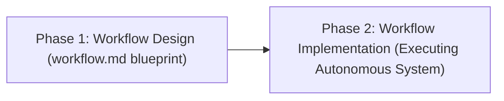
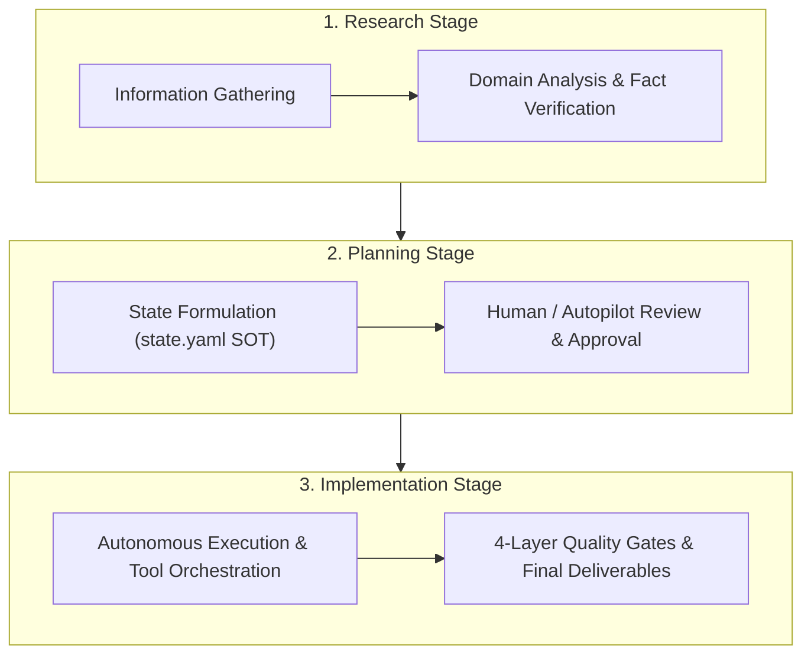
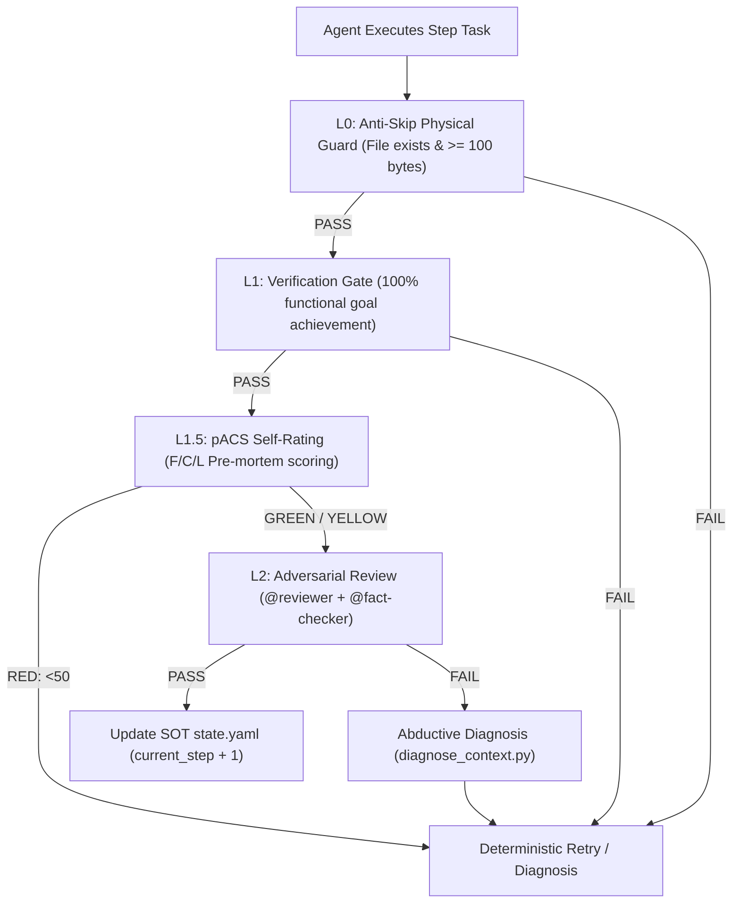

<div align="center">

# ⚡ AgenticWorkflow ⚡

### Pluripotent Stem-Cell Framework & Universal Agentic Toolchain
**Deterministic Quality Gates • Multi-Engine Autopilot • Single-File SOT • TOON v4.1 Density**

[](LICENSE)
[](https://bun.sh)
[](https://python.org)
[](https://www.typescriptlang.org/)
[](https://www.npmjs.com/package/agentic-workflow)
[](https://pypi.org/project/agentic-workflow)
[](https://skills.sh)
[](https://claude.ai)
[](https://cursor.com)
[](https://github.com/imMamdouhaboammar/agentic-workflow/actions)

<p align="center">
  <a href="#-universal-installation--quickstart">Quickstart</a> •
  <a href="#1--one-click-agent-self-install--init-prompt">Agent Prompt</a> •
  <a href="#-why-agenticworkflow-exists">Why It Exists</a> •
  <a href="#-architecture">Architecture</a> •
  <a href="#-dual-language-sdk-usage">SDK Usage</a> •
  <a href="#-cli-reference">CLI Reference</a> •
  <a href="#-supportive-tools">Supportive Tools</a> •
  <a href="#-license">License</a>
</p>

</div>

---

## 🚀 Universal Installation & Quickstart

AgenticWorkflow is packaged and distributable across every major package registry, AI harness, and container platform:

### 1. 🤖 One-Click Agent Self-Install & Init Prompt

Paste this prompt directly into your AI coding agent (Claude Code, Antigravity / Gemini CLI, Cursor, Codex, OpenCode, or Windsurf) to let it autonomously install, configure, initialize, and verify `AgenticWorkflow` in one shot:

<details>
<summary><b>👉 Click to expand the Smart Agent Prompts (Master Prompt & Quick-Fire)</b></summary>

<br>

> [!TIP]
> **Copy & Paste into your Agent Chat:**

````markdown
You are acting as an autonomous DevOps & Systems Integration Agent. 
Your objective is to install, configure, initialize, and verify the `agentic-workflow` framework in this workspace in a single uninterrupted execution loop.

Execute the following 4 phases autonomously:

### Phase 1: Universal Installation
1. Detect available runtimes on the system (`python3`, `bun`, `npm`, `curl`, `git`).
2. Run the universal one-line installer:
   ```bash
   curl -fsSL https://raw.githubusercontent.com/imMamdouhaboammar/agentic-workflow/main/install.sh | bash
   ```
   *(Fallback if offline or in a local clone: run `./install.sh` or `bun add -g agentic-workflow` / `npm install -g agentic-workflow`)*.
3. Ensure `~/.local/bin` is in `$PATH` so the `agentic-workflow` CLI binary is immediately executable.

### Phase 2: Host & Workspace Configuration
1. Detect the current agent harness and verify registration in the appropriate skill directories:
   - Claude Code: `~/.claude/skills/agentic-workflow`
   - Gemini CLI / Antigravity: `~/.gemini/config/skills/agentic-workflow`
   - Cursor: `~/.cursor/skills/agentic-workflow`
   - Codex / OpenCode: `~/.codex/skills/agentic-workflow`
   - Universal Agent Kernel: `~/.agents/skills/agentic-workflow`
2. If this workspace lacks an `AGENTS.md` directive, link or import the AgenticWorkflow constitution (`AGENTS.md` and `GEMINI.md` / `CLAUDE.md`) so all subagents inherit:
   - Absolute Criterion 1: Deliverable Quality over speed/token cost.
   - Absolute Criterion 2: Single-File SOT (`state.yaml`) with single-writer lock.
   - Absolute Criterion 3: Code Change Protocol (CCP: Understand Intent → Ripple Effect Analysis → Step Plan).
   - 4-Layer Quality Assurance: L0 Anti-Skip → L1 Verification → L1.5 pACS Pre-mortem scoring → L2 Adversarial Review.
3. Provision supportive tools by running:
   ```bash
   agentic-workflow integrations install
   ```
   Confirm integration of Ponytail (YAGNI & surgical diffs), TOON v4.1 (token compression), Fable (circuit breaker), and Caveman (concise mode).

### Phase 3: Initialization (`init`)
1. Run the native initialization command:
   ```bash
   agentic-workflow init
   ```
2. Confirm that:
   - Runtime directories (`context-snapshots/`, `autopilot-logs/`, `diagnosis-logs/`) are generated.
   - Core hook scripts in `.claude/hooks/scripts/` have validated syntax and execution permissions.
   - The skills mesh index (`core/skills_indexer.py`) is indexed and queryable.

### Phase 4: Validation & Status Report
1. Verify the setup by running:
   ```bash
   agentic-workflow validate
   agentic-workflow integrations status
   ```
2. Print a concise completion summary formatted in TOON v4.1 or a clean Markdown table showing CLI status, host skill registration paths, supportive tools readiness, and quality gates status.

Proceed and execute all steps now without stopping for manual input.
````

#### ⚡ Quick-Fire Version
```text
Run the universal installer for AgenticWorkflow (`curl -fsSL https://raw.githubusercontent.com/imMamdouhaboammar/agentic-workflow/main/install.sh | bash`), link CLI to PATH, run `agentic-workflow init` to configure SOT runtime and supportive tools (Ponytail, TOON, Fable, Caveman), and run `agentic-workflow validate` to confirm 100% readiness. Report the final status table when done.
```

</details>

### 2. Agent Skill Hubs (Zero-Install Agent Registration)

```bash
# Skills.sh / Vercel Ecosystem (Any Agent)
npx skills add imMamdouhaboammar/agentic-workflow

# Universal One-Line Installer (Claude, Gemini, Cursor, Codex, OpenCode)
curl -fsSL https://raw.githubusercontent.com/imMamdouhaboammar/agentic-workflow/main/install.sh | bash
```

### 3. Package Managers (CLI & SDK)

| Registry / Host | Command | Usage |
|---|---|---|
| **Bun (Instant CLI)** | `bunx @mamdouh-aboammar/agentic-workflow [command]` | Zero-install CLI execution |
| **Bun (Library)** | `bun add @mamdouh-aboammar/agentic-workflow` | TypeScript / Bun SDK dependency |
| **npm / npx (Node)** | `npx @mamdouh-aboammar/agentic-workflow [command]` | Zero-install Node CLI execution |
| **npm (Library)** | `npm install @mamdouh-aboammar/agentic-workflow` | Node.js ESM library dependency |
| **PyPI (Python)** | `pip install agenticworkflow` | Python library & console script |
| **Homebrew (macOS/Linux)** | `brew install imMamdouhaboammar/tap/agentic-workflow` | System binary via Homebrew |
| **Docker Container** | `docker run -it ghcr.io/immamdouhaboammar/agentic-workflow` | Isolated, containerized runner |

---

## ⚡ Why AgenticWorkflow Exists

Most AI workflows fail in production due to three compounding traps:
1. **Hallucinated Progress**: Agents mark tasks complete without verifying actual deliverables on disk.
2. **Context Amnesia**: Sessions reset or compact, losing critical context and historical failures.
3. **Unchecked Drift**: Multi-agent swarms mutate shared state simultaneously, causing race conditions and logic divergence.

AgenticWorkflow eliminates these failure modes with a 2-stage execution model backed by deterministic Python and TypeScript safety rails:



Creating `workflow.md` is only half the journey. **The ultimate goal is that the workflow executes reliably and produces verified deliverables.**

---

## 🏛️ 3-Stage Core Architecture

Every workflow strictly follows three sequential stages:



1. **Research** — Information gathering, competitive benchmarking, and deep domain analysis.
2. **Planning** — Architecture blueprint formulation, task decomposition, and human/autopilot sign-off.
3. **Implementation** — Multi-agent tool execution, code generation, and artifact verification.

---

## 🛡️ 4-Layer Quality Assurance Stack

Every step completion must pass up to 4 verification layers before the Orchestrator advances the Single Source of Truth (`state.yaml`):



| Layer | Gate Name | Target Verified | Mechanism |
|---|---|---|---|
| **L0** | Anti-Skip Guard | Physical deliverable exists and size $\ge 100$ bytes | Deterministic Python hook |
| **L1** | Verification Gate | 100% achievement of declared task acceptance criteria | Semantic agent self-verification |
| **L1.5** | pACS Calibration | 3D confidence scoring (Faithfulness, Completeness, Logic) | Pre-mortem protocol ($\min(F, C, L)$) |
| **L2** | Adversarial Review | Independent critique, claim audit, and web fact-checking | `@reviewer` + `@fact-checker` subagents |

---

## 💻 Dual-Language SDK Usage

### TypeScript & Bun (`npm install agentic-workflow` or `bun add agentic-workflow`)

```typescript
import { 
  AutopilotEngine, 
  HookDispatcher, 
  IntegrationInstaller, 
  encodeToon, 
  calculateTokenSavings 
} from 'agentic-workflow';

// 1. Token-Oriented Object Notation (v4.1) compression
const data = {
  users: [
    { id: 1, name: "Alice", role: "architect" },
    { id: 2, name: "Bob", role: "reviewer" }
  ]
};
const toonData = encodeToon(data);
console.log(`Compressed TOON:\n${toonData}`);

// 2. Hook Dispatcher evaluation
const dispatcher = new HookDispatcher(process.cwd());
const check = dispatcher.dispatch({
  event_id: "evt_1",
  source: "cli",
  hook_type: "pre_command",
  timestamp: Date.now(),
  command: "git status"
});
console.log(`Hook verdict: ${check.verdict}`);
```

### Python (`pip install agentic-workflow`)

```python
from agentic_workflow import (
    AutopilotEngine, 
    HookDispatcher, 
    IntegrationInstaller,
    CleanCodeChecker,
    MultiAgentManager
)

# 1. Launch Autopilot Engine
engine = AutopilotEngine(project_dir=".", auto_approve=True)
engine.plan_default_workflow(
    title="Data Ingestion Pipeline", 
    goal="Autonomous end-to-end data ingestion with quality gates"
)
success = engine.run_all()

# 2. Check Supportive Tools Status
installer = IntegrationInstaller(project_dir=".")
results = installer.check_all()
for r in results:
    print(f"- {r.name}: {r.status}")
```

---

## ⚙️ CLI Reference

```bash
# Launch autonomous end-to-end autopilot workflow with self-fueling & energy management
agentic-workflow autopilot --title "Production Pipeline" --goal "Autonomous Delivery"

# Run Clean Code Guard audit pass (SOLID, 24 Imperatives, AI failure modes)
agentic-workflow guard [directory]

# Execute AI Engineer fairness, drift, and prompt-injection evaluation gates
agentic-workflow eval

# Query multi-agent observable trace logs and spans
agentic-workflow traces

# Manage supportive tools (Ponytail, TOON, Fable, Caveman) & lifecycle
agentic-workflow integrations status
agentic-workflow integrations install
agentic-workflow integrations phase planning

# Token-Oriented Object Notation (v4.1) benchmarks and conversion
agentic-workflow toon benchmark
agentic-workflow toon convert <file.json>

# Initialize infrastructure, SOT runtime directories, and supportive tools
agentic-workflow init

# Validate workflow.md, SOT schema, and pACS integrity
agentic-workflow validate

# Check current workflow progress and observability dashboard
agentic-workflow status

# Run full automated test suite (16 suites: safety, guard, MAS, engines, integrations)
agentic-workflow test
```

---

## 🧰 Supportive Tools Ecosystem

AgenticWorkflow automatically provisions and directs specialized supportive tools across its execution phases without manual user overhead:

| Supportive Tool | Role & Category | Designated Lifecycle Phase |
|---|---|---|
| **[Ponytail](https://github.com/DietrichGebert/ponytail)** | **Simplicity Governor & Anti-Debt** | **Planning & Implementation**: Enforces YAGNI ladder, stdlib-first, and shortest working surgical diffs. |
| **[TOON](https://github.com/toon-format/toon)** | **Token-Oriented Object Notation (v4.1)** | **Continuous Data Protocol**: Cuts structured data and state tokens by 30-60% across all deliverables and logs. |
| **[Fable](https://github.com/imMamdouhaboammar/get-fable)** | **Lifecycle Harness & Continuation** | **Execution & Handoff**: Arms circuit breakers (halts on failure streak $\ge 2$) and generates durable continuation state (`.fable/`). |
| **[Caveman](https://github.com/JuliusBrussee/caveman)** | **Terse Communication Mode** | **Continuous Protocol**: Strips conversational fluff to cut output tokens by 65-75% while keeping code and errors exact. |

---

## 📜 Absolute Criteria (Canon)

These constitutional rules govern every design, execution, and modification decision:

1. **Absolute Criterion 1: Quality of the Final Deliverable**
   > Speed, token cost, workload, and length limits are completely ignored. The sole criterion for every decision is the **quality of the final deliverable**.
2. **Absolute Criterion 2: Single-File SOT + Hierarchical Memory**
   > All shared workflow state is concentrated in a single file (`state.yaml`). Write permission belongs exclusively to the Orchestrator / Team Lead. Parallel agents never mutate shared files simultaneously.
3. **Absolute Criterion 3: Code Change Protocol (CCP)**
   > Before writing, modifying, adding, or deleting code, you must perform **Step 1 (Understand Intent) → Step 2 (Ripple Effect Analysis) → Step 3 (Change Plan)**. Governed by Coding Anchor Points (CAP-1~4).

---

## 📖 Documentation Roadmap

1. **README.md** (This document) — High-level bird's-eye overview and distribution hub.
2. [`soul.md`](soul.md) — The philosophical core and DNA inheritance principles.
3. [`AGENTICWORKFLOW-ARCHITECTURE-AND-PHILOSOPHY.md`](AGENTICWORKFLOW-ARCHITECTURE-AND-PHILOSOPHY.md) — Architectural design and theoretical foundations.
4. [`DECISION-LOG.md`](DECISION-LOG.md) — Complete historical record of architectural decisions (ADRs).
5. [`AGENTICWORKFLOW-USER-MANUAL.md`](AGENTICWORKFLOW-USER-MANUAL.md) — Practical step-by-step operating instructions.
6. [`AGENTS.md`](AGENTS.md) — Universal directive and constitutional rules.
7. [`docs/protocols/`](docs/protocols/) — Deep-dive execution protocols.

---

## 📄 License

MIT License © 2026 Mamdouh Aboammar & Yoonsik Choi. All rights reserved.
