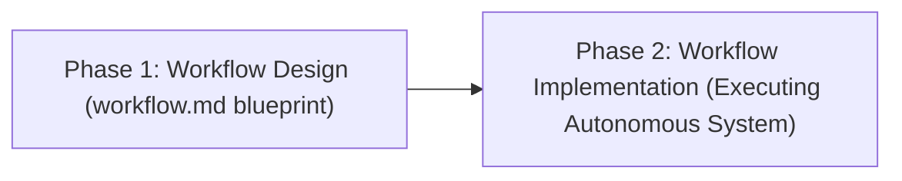
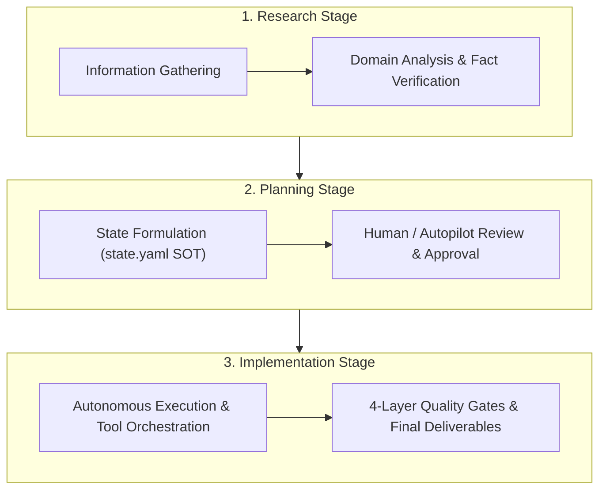
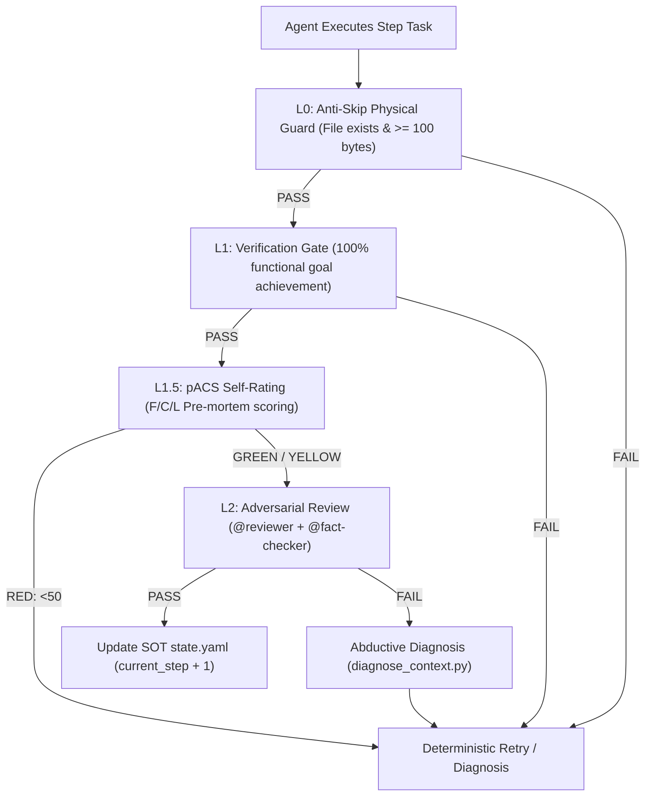

# AgenticWorkflow

> **A Pluripotent Stem-Cell Framework and Universal Agentic Toolchain for Autonomous Workflows.**

[](https://opensource.org/licenses/MIT)
[](https://bun.sh)
[](https://nodejs.org)
[](https://claude.ai)
[](https://deepmind.google)
[](https://skills.sh/agentic-workflow)

Systematically design complex tasks into robust workflows and execute them autonomously with deterministic quality gates. Just as pluripotent stem cells differentiate into any specialized cell while preserving the complete parental genome, this framework generates and executes agentic workflows across research, deep analysis, software development, and systems engineering—structurally embedding constitutional quality standards into every child system.

---

## Why AgenticWorkflow Exists

Most AI workflows fail in production due to three compounding traps:
1. **Hallucinated Progress**: Agents mark tasks complete without verifying actual deliverables on disk.
2. **Context Amnesia**: Sessions reset or compact, losing critical context and historical failures.
3. **Unchecked Drift**: Multi-agent swarms mutate shared state simultaneously, causing race conditions and logic divergence.

AgenticWorkflow eliminates these failure modes with a 2-stage execution model backed by deterministic Python safety rails:



Creating `workflow.md` is only half the journey. **The ultimate goal is that the workflow executes reliably and produces verified deliverables.**

---

## 3-Stage Core Architecture

Every workflow strictly follows three sequential stages:



1. **Research** — Information gathering, competitive benchmarking, and deep domain analysis.
2. **Planning** — Architecture blueprint formulation, task decomposition, and human/autopilot sign-off.
3. **Implementation** — Multi-agent tool execution, code generation, and artifact verification.

---

## 4-Layer Quality Assurance Stack

Every step completion must pass up to 4 verification layers before the Orchestrator advances the Single Source of Truth (`state.yaml`):



| Layer | Gate Name | Target Verified | Mechanism |
|---|---|---|---|
| **L0** | Anti-Skip Guard | Physical deliverable exists and size >= 100 bytes | Deterministic Python hook |
| **L1** | Verification Gate | 100% achievement of declared task acceptance criteria | Semantic agent self-verification |
| **L1.5** | pACS Calibration | 3D confidence scoring (Faithfulness, Completeness, Logic) | Pre-mortem protocol (`min(F, C, L)`) |
| **L2** | Adversarial Review | Independent critique, claim audit, and web fact-checking | `@reviewer` + `@fact-checker` subagents |

---

## Absolute Criteria

These top-level constitutional rules govern every design, execution, and modification decision:

1. **Absolute Criterion 1: Quality of the Final Deliverable**
   > Speed, token cost, workload, and length limits are completely ignored. The sole criterion for every decision is the **quality of the final deliverable**.
2. **Absolute Criterion 2: Single-File SOT + Hierarchical Memory**
   > All shared workflow state is concentrated in a single file (`state.yaml`). Write permission belongs exclusively to the Orchestrator / Team Lead. Parallel agents never mutate shared files simultaneously.
3. **Absolute Criterion 3: Code Change Protocol (CCP)**
   > Before writing, modifying, adding, or deleting code, you must perform **Step 1 (Understand Intent) → Step 2 (Ripple Effect Analysis) → Step 3 (Change Plan)**. Governed by Coding Anchor Points (CAP-1~4).
4. **Constitutional Hierarchy**
   > Quality First is supreme. SOT and CCP are co-equal means to guarantee quality; when principles conflict, Quality always wins.

---

## Universal Multi-Agent Toolchain & Installation

AgenticWorkflow is configured as a first-class universal agentic skill and CLI runner supporting Claude Code, Google Antigravity, Gemini CLI, Cursor, Codex, OpenCode, and Skills.sh.

### 1. One-Click Global Install

Run the automated cross-agent installer:

```bash
curl -fsSL https://raw.githubusercontent.com/imMamdouhaboammar/agentic-workflow/main/install.sh | bash
```

Or clone and run locally:

```bash
git clone https://github.com/imMamdouhaboammar/agentic-workflow.git
cd agentic-workflow
chmod +x install.sh && ./install.sh
```

### 2. NPM / Bun CLI Runner

Install or run directly via `bunx` or `npx`:

```bash
# Run directly without installation
bunx agentic-workflow --help

# Or install globally
bun add -g agentic-workflow
```

### 3. CLI Commands

```bash
# Initialize infrastructure, SOT runtime directories, and health checks
agentic-workflow init

# Validate workflow.md, SOT schema, and pACS integrity
agentic-workflow validate

# Check current workflow progress and observability dashboard
agentic-workflow status

# Run internal test suite (43 safety tests + 88 security tests)
agentic-workflow test
```

---

## Multi-Host Compatibility (Hub-and-Spoke)

| Platform | Interface | Contract | Auto-Applied |
|---|---|---|---|
| **Claude Code** | `CLAUDE.md` + `.claude/settings.json` | Slash commands, hooks, subagents | Yes |
| **Antigravity / Gemini CLI** | `GEMINI.md` + `SKILL.md` | Single-session role switching, Python hooks | Yes |
| **Cursor** | `.cursor/rules/agenticworkflow.mdc` | Project rules, agent mode | Yes |
| **Codex / OpenCode** | `package.json` + `marketplace.json` | CLI tools, plugin manifests | Yes |
| **Skills.sh** | `.skills.json` | Vercel agent registry | Yes |

---

## Autonomous Execution Modes

### Autopilot Mode
Enables non-blocking autonomous execution:
- Automatically approves `(human)` review checkpoints using quality-maximizing defaults.
- Records all rationale into `autopilot-logs/step-N-decision.md`.
- Safety hook blocks (`(hook)` exit code 2) remain active and cannot be bypassed.

### ULW (Ultrawork) Mode
An orthogonal thoroughness intensity overlay activated whenever `ulw` is detected:
- **I-1. Sisyphus Persistence**: Mandatory 3 retries per failure, each testing an alternative hypothesis. Quality gate retry budget expands to 15.
- **I-2. Mandatory Task Decomposition**: Strict `TaskCreate → TaskUpdate` decomposition for all non-trivial tasks.
- **I-3. Bounded Retry Escalation**: Prohibits infinite loops by enforcing structured escalation on consecutive failures.

---

## Repository Structure

```
AgenticWorkflow/
├── SKILL.md                         # Universal Agentic Skill definition (Hub)
├── package.json                     # Universal npm/Bun CLI manifest
├── marketplace.json                 # Claude Plugin marketplace manifest
├── .skills.json                     # Skills.sh agent registry manifest
├── install.sh                       # Universal cross-agent installer
├── bin/
│   └── cli.js                       # Executable CLI entry point
├── CLAUDE.md                        # Claude Code directive
├── AGENTS.md                        # Universal agent constitutional SOT
├── GEMINI.md                        # Gemini CLI / Antigravity directive
├── soul.md                          # DNA inheritance & philosophical constitution
├── DECISION-LOG.md                  # 51+ Architecture Decision Records (ADRs)
├── AGENTICWORKFLOW-USER-MANUAL.md   # Comprehensive end-to-end user manual
├── AGENTICWORKFLOW-ARCHITECTURE-AND-PHILOSOPHY.md # Architectural philosophy
├── docs/protocols/                  # Deep operational protocols
│   ├── autopilot-execution.md       # Execution checklist & NEVER DO rules
│   ├── quality-gates.md             # L0-L2 quality gates & P1 validation
│   ├── ulw-mode.md                  # Ultrawork mode & Sisyphus persistence
│   ├── context-preservation-detail.md # Hook architecture & Knowledge Archive
│   └── code-change-protocol.md      # CCP 3-step protocol & CAP rules
├── .claude/
│   ├── settings.json                # Hook configurations
│   ├── agents/                      # Subagents (reviewer, fact-checker, translator)
│   ├── commands/                    # Slash commands (/install, /maintenance, etc.)
│   ├── hooks/scripts/               # 22 Python hook & deterministic safety scripts
│   └── skills/                      # Core skills (workflow-generator, doctoral-writing)
├── prompt/                          # PRD investigation frameworks
├── prompt-runner/                   # Automated 110-prompt batch execution engine
└── translations/glossary.yaml       # Standardized terminology registry
```

---

## Documentation Reading Order

1. **README.md** (This document) — High-level bird's-eye overview.
2. [`soul.md`](soul.md) — The philosophical core and DNA inheritance principles.
3. [`AGENTICWORKFLOW-ARCHITECTURE-AND-PHILOSOPHY.md`](AGENTICWORKFLOW-ARCHITECTURE-AND-PHILOSOPHY.md) — Architectural design and theoretical foundations.
4. [`DECISION-LOG.md`](DECISION-LOG.md) — Complete historical record of architectural decisions (ADRs).
5. [`AGENTICWORKFLOW-USER-MANUAL.md`](AGENTICWORKFLOW-USER-MANUAL.md) — Practical step-by-step operating instructions.
6. [`AGENTS.md`](AGENTS.md) — Universal directive and constitutional rules.
7. [`docs/protocols/`](docs/protocols/) — Deep-dive execution protocols.

---

## License

MIT License © 2026 Mamdouh Aboammar & Yoonsik Choi. All rights reserved.
