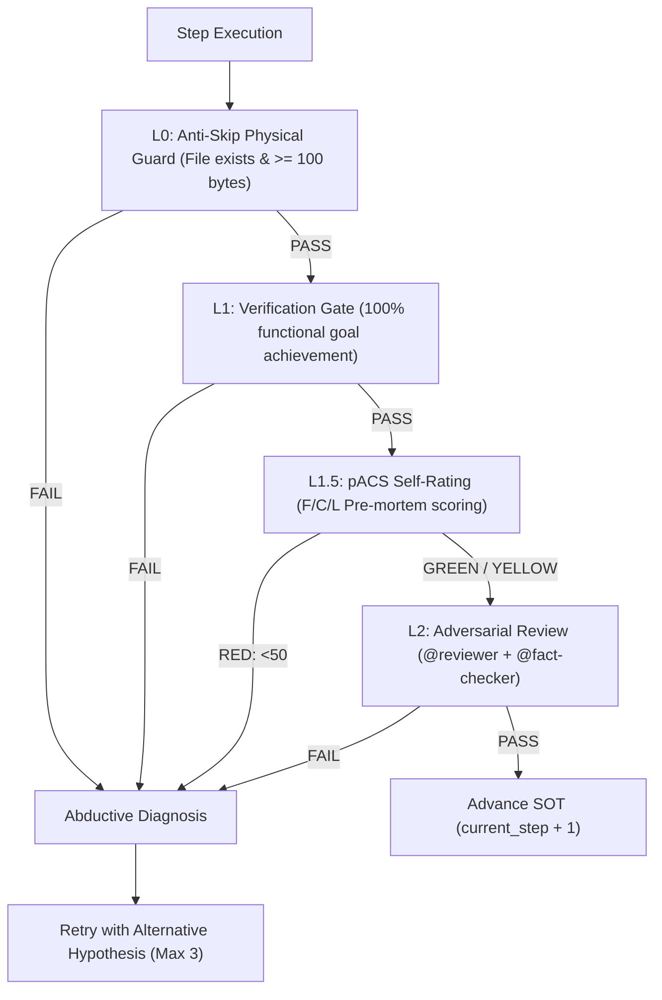

# AgenticWorkflow: Universal Agentic Skill & Execution Toolchain

A pluripotent stem-cell framework and multi-agent execution engine that turns complex tasks into deterministic, self-verifying autonomous workflows.

## Execution Invariant

$$\\text{Intent} \\xrightarrow{\\text{Research}} \\text{Plan (SOT state.yaml)} \\xrightarrow{\\text{Implementation}} \\text{4-Layer Quality Gates} \\xrightarrow{\\text{pACS Delta}} \\text{Verified Deliverable}$$

---

## ⚡ Dynamic Mode Router

Detect the desired mode from context or explicit flags:

| Mode | Trigger Phrases | Core Execution Flow |
|---|---|---|
| **1. DESIGN** | "design workflow", "new pipeline", "workflow.md" | Research → Planning → Implementation 3-stage blueprint generation |
| **2. EXECUTE** | "run workflow", "execute pipeline", "start step" | SOT state-machine driver with step-by-step deliverable generation |
| **3. AUTOPILOT**| "autopilot", "fully automated", "hands-off" | Auto-approve `(human)` checkpoints with decision logs; enforce safety hooks |
| **4. ULW** | "ulw", "ultrawork", "maximum rigor" | 3 Intensifiers: Sisyphus Persistence, Mandatory Decomposition, Retry Escalation |
| **5. VERIFY** | "verify step", "quality gates", "run pacs" | L0 Anti-Skip → L1 Verification → L1.5 pACS → L2 Adversarial Review |
| **6. OPTIMIZE**| "optimize workflow", "reduce cycle time", "streamline" | Lean bottleneck analysis, automation scoring, cycle time compression |

---

## 3 Absolute Criteria (Constitutional Canon)

Every workflow, tool, and subagent created or governed by this skill strictly inherits the 3 Absolute Criteria:

1. **Absolute Criterion 1: Quality of the Final Deliverable**
   > Speed, token cost, workload, and length limits are completely ignored. The sole criterion for every decision is the **quality of the final deliverable**.
2. **Absolute Criterion 2: Single-File SOT + Hierarchical Memory**
   > All shared state is concentrated in a single file (`state.yaml`). SOT write permission belongs exclusively to the Orchestrator / Team Lead. Parallel agents never mutate shared files simultaneously.
3. **Absolute Criterion 3: Code Change Protocol (CCP)**
   > Before writing, modifying, adding, or deleting code, internally perform: Step 1 (Understand Intent) → Step 2 (Ripple Effect Analysis) → Step 3 (Change Plan). Governed by Coding Anchor Points (CAP-1~4).

---

## 4-Layer Quality Assurance Stack



1. **L0 Anti-Skip Guard**: Deterministically verifies deliverable exists on disk and is non-empty (`MIN_OUTPUT_SIZE >= 100 bytes`).
2. **L1 Verification Gate**: Semantic verification that all acceptance criteria are 100% achieved.
3. **L1.5 pACS (Predicted Agent Confidence Score)**: Pre-mortem evaluation across Faithfulness, Completeness, Logic. $pACS = \\min(F, C, L)$.
   - `GREEN (>= 70)`: Auto-advance.
   - `YELLOW (50 - 69)`: Flag weak dimension in Decision Log and proceed.
   - `RED (< 50)`: Halt and trigger rework.
4. **L2 Adversarial Review**: Independent Generator-Critic evaluation by `@reviewer` and `@fact-checker`.

---

## Workflow Optimization Engine (Lean & Automation)

When analyzing or optimizing workflows:
- **Bottleneck Severity**: Score bottlenecks 1 to 5.
- **Automation Potential**: Quantify manual tasks for agentic delegation.
- **Error Reduction**: Implement quality gates at root causes before failure propagation.
- **Cycle Time Reduction**: Target >= 40% cycle time reduction while raising deliverable quality.

---

## CLI & Toolchain Integration

```bash
# Initialize infrastructure, SOT runtime dirs, and health checks
agentic-workflow init

# Validate workflow schema, SOT integrity, and pACS logs
agentic-workflow validate

# Check live workflow dashboard and observability metrics
agentic-workflow status

# Run safety, security, and verification test suite
agentic-workflow test
```

---

## Reference Map

- Architecture & DNA: `soul.md`, `AGENTICWORKFLOW-ARCHITECTURE-AND-PHILOSOPHY.md`
- Operating Manual: `AGENTICWORKFLOW-USER-MANUAL.md`
- Common Directive: `AGENTS.md`, `CLAUDE.md`, `GEMINI.md`
- Protocols: `docs/protocols/` (autopilot-execution, quality-gates, ulw-mode, code-change-protocol, context-preservation-detail)
- Subagents: `.claude/agents/` (reviewer, fact-checker, translator)
- Scripts: `.claude/hooks/scripts/` (context_guard, validate_pacs, validate_review, etc.)
